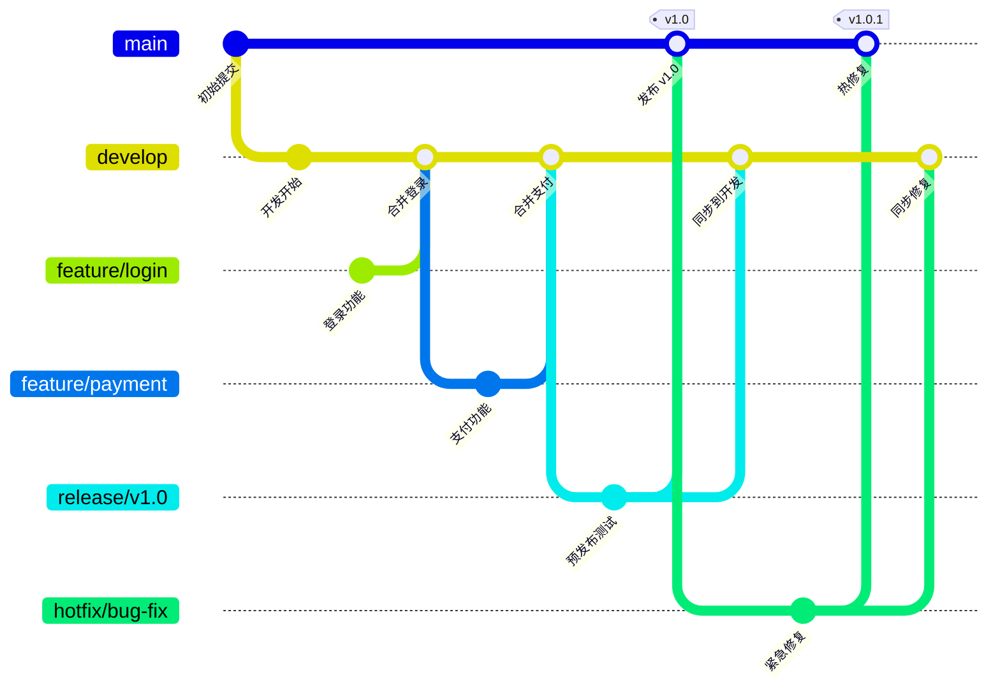
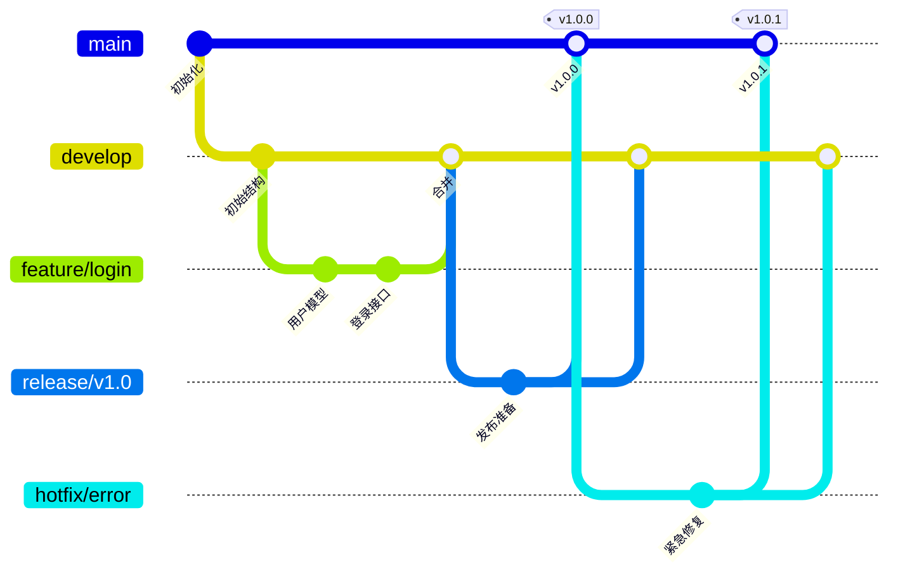
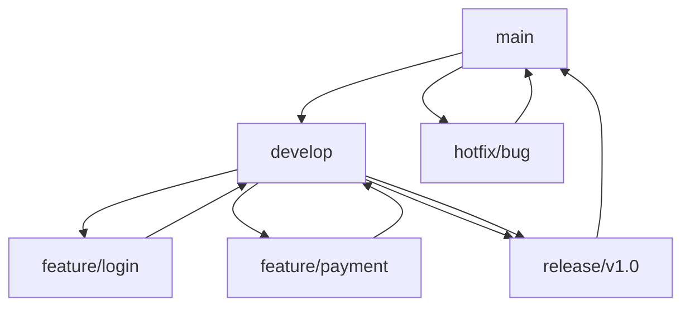
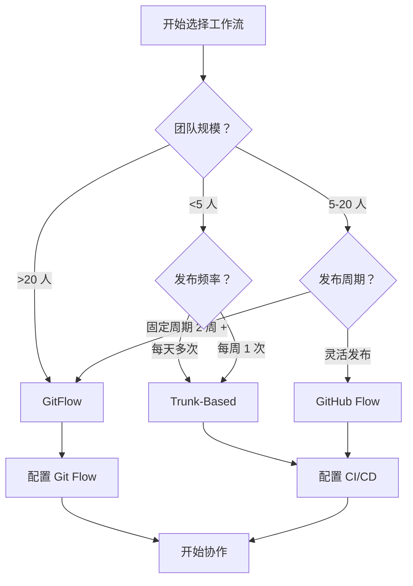

# Git 完全教程 - 从零基础到企业级实战

> 📘 **最系统、最详细的 Git 学习指南**  
> 覆盖「零基础入门 → 核心原理 → 日常操作 → 企业级协作 → 故障排查」完整路径  
> **版本**: v5.1 | **更新时间**: 2026-03-21 | **字数**: ~95,000  
> **Git 版本要求**: 建议 Git 2.23+（部分新命令需要）

---

## 📋 版本兼容性说明

<details>
<summary>📌 点击展开版本兼容性说明</summary>

本教程中的命令按 Git 版本兼容性分类：

### 命令版本标识

| 标识 | 说明 | 建议 |
|:---|:---|:---|
| **全部** | 所有 Git 版本支持 | ✅ 安全使用 |
| **2.23+** | Git 2.23 及以上版本 | ⚠️ 检查版本 |
| **2.0+** | Git 2.0 及以上版本 | ⚠️ 检查版本 |

### 检查 Git 版本

```bash
git --version
```

**示例输出**：
```bash
$ git --version
git version 2.43.0
```

**版本过低怎么办？**

**Ubuntu/Debian**：
```bash
sudo add-apt-repository ppa:git-core/ppa
sudo apt update
sudo apt install git
```

**CentOS/RHEL**：
```bash
sudo yum install https://repo.ius.io/ius-release-el7.rpm
sudo yum install git236
```

**macOS**：
```bash
brew install git
```

**Windows**：
```
访问：https://git-scm.com/download/win
下载并安装最新版
```

### 现代命令 vs 传统命令

本教程优先使用现代命令（语义更清晰），同时提供传统命令作为备选：

| 功能 | 现代命令（2.23+） | 传统命令（全部） |
|:---|:---|:---|
| 切换分支 | `git switch <branch>` | `git checkout <branch>` |
| 创建并切换 | `git switch -c <branch>` | `git checkout -b <branch>` |
| 恢复文件 | `git restore <file>` | `git checkout -- <file>` |
| 从暂存区恢复 | `git restore --staged <file>` | `git reset HEAD <file>` |

**建议**：
- Git 2.23+ 用户：使用现代命令
- 低版本用户：使用传统命令
- 团队开发：统一命令风格

</details>

---

## 📖 目录

### 基础篇
1. [Git 安装与配置](#第 1 章-git-安装与配置)
2. [Git 初始化与基本操作](#第 2 章-git-初始化与基本操作)
3. [分支管理](#第 3 章-分支管理)
4. [标签使用](#第 4 章-标签使用)
5. [远程仓库操作](#第 5 章-远程仓库操作)

### 进阶篇
6. [Git 核心底层原理](#第 6 章-git-核心底层原理)
7. [Git 企业级协作规范](#第 7 章-git-企业级协作规范)
8. [Git 钩子与工程化集成](#第 8 章-git-钩子与工程化集成)

### 实战篇
9. [Git 故障排查与数据恢复](#第 9 章-git-故障排查与数据恢复)
10. [高频常见问题解决方案](#第 10 章-高频常见问题解决方案)

### 附录
- [命令速查表](#附录-命令速查表)
- [Git 工作流对比](#附录-git-工作流对比)
- [学习路径建议](#附录-学习路径建议)

---

## 第 1 章 Git 安装与配置

### 1.1 Git 简介

> **Git** 是一个分布式版本控制系统，用于跟踪计算机文件的更改，并协调多人之间的工作。
> 
> 由 Linux 之父 **Linus Torvalds** 于 2005 年创建，最初目的是为了更好地管理 Linux 内核开发。

**核心特点**：

| 特点 | 说明 | 优势 |
|:---|:---|:---|
| **分布式架构** | 每个开发者都有完整仓库 | 离线工作、数据冗余、更安全 |
| **强大的分支管理** | 轻量级分支，秒级创建 | 并行开发、功能隔离、易于合并 |
| **数据完整性** | SHA-1 哈希校验 | 防止篡改、版本可追溯 |
| **支持离线操作** | 大部分操作无需网络 | 随时随地工作，联网后同步 |

**Git 工作流示意图**：
```
┌──────────────┐     ┌──────────────┐     ┌──────────────┐
│  工作区      │ →   │  暂存区      │ →   │  本地仓库    │
│  (Workspace) │     │  (Stage)     │     │  (Repository)│
│  修改文件    │     │  准备提交    │     │  永久保存    │
└──────────────┘     └──────────────┘     └──────────────┘
       ↓                    ↓                    ↓
   git add              git commit            git push
                                              ↓
                                       ┌──────────────┐
                                       │  远程仓库    │
                                       │  (Remote)    │
                                       └──────────────┘
```

---

### 1.2 安装 Git

#### Windows 系统

**方法 1：官网安装包（推荐）**

```bash
# 1. 下载安装包
访问：https://git-scm.com/download/win
下载：Git-for-Windows 安装包（64 位）

# 2. 运行安装程序
双击 Git-xxx.exe → 按向导安装
建议选项：
  ✓ 使用 VS Code 作为默认编辑器
  ✓ 让 Git 命令在命令行中可用
  ✓ 使用 Windows 默认控制台窗口

# 3. 验证安装
打开 CMD 或 PowerShell
git --version
```

**输出示例**：
```bash
C:\Users\example> git --version
git version 2.43.0.windows.1
```

**方法 2：使用包管理器（适合开发者）**

```bash
# 使用 Chocolatey 安装
choco install git -y

# 使用 Winget 安装（Windows 10+）
winget install Git.Git

# 验证安装
git --version
```

---

#### macOS 系统

**方法 1：Homebrew 安装（推荐）**

```bash
# 1. 安装 Homebrew（如果未安装）
/bin/bash -c "$(curl -fsSL https://raw.githubusercontent.com/Homebrew/install/HEAD/install.sh)"

# 2. 使用 Homebrew 安装 Git
brew install git

# 3. 验证安装
git --version
```

**输出示例**：
```bash
example-user@macbook ~ % git --version
git version 2.43.0
```

**方法 2：Xcode Command Line Tools**

```bash
# 安装 Xcode 命令行工具（包含 Git）
xcode-select --install

# 按提示点击"安装"，等待完成

# 验证安装
git --version
```

**说明**：
- 适合需要完整 Apple 开发环境的用户
- 包含 Git、clang、make 等开发工具

---

#### Linux 系统

**CentOS/RHEL 系统**

```bash
# 使用 YUM 安装（CentOS 7/8）
yum install git -y

# 验证安装
git --version
```

**输出示例**：
```bash
[root@gitlab ~]# git --version
git version 2.20.1
```

**Ubuntu/Debian 系统**

```bash
# 更新软件包列表
apt update

# 使用 APT 安装
apt install git -y

# 验证安装
git --version
```

**输出示例**：
```bash
root@ubuntu:~# git --version
git version 2.25.1
```

---

### 1.3 必备配置项

#### 用户信息配置

```bash
# 全局配置（推荐）
git config --global user.name "example-user"
git config --global user.email "1656126280@qq.com"

# 仓库级配置
cd /path/to/repo
git config --local user.name "project-user"
git config --local user.email "project@example.com"
```

**说明**：
- `--global`：全局配置，保存在 `~/.gitconfig`，对所有仓库生效
- `--local`：仓库级配置，保存在 `.git/config`，仅对当前仓库生效
- 用户名和邮箱会显示在每次提交记录中

---

#### 中文文件名乱码解决方案

> ⚠️ **问题**：在 Windows/macOS 上，中文文件名的文件在 `git status` 中显示为八进制编码

**解决方法**：
```bash
# 禁用 quotepath，让 Git 直接显示 UTF-8 文件名
git config --global core.quotepath false

# 验证配置
git config --global core.quotepath
```

**输出示例**：
```bash
# 配置前
$ git status
    修改：\346\265\213\350\257\225.txt

# 配置后
$ git status
    修改：测试.txt
```

---

#### 跨平台换行符兼容配置

> 📝 **背景**：Windows 使用 CRLF (`\r\n`)，Linux/macOS 使用 LF (`\n`)，跨平台协作时需要统一

**配置方案**：

```bash
# 方案 1：推荐配置（自动转换）
git config --global core.autocrlf input    # Linux/macOS
git config --global core.autocrlf true     # Windows

# 方案 2：严格模式（提交时检查）
git config --global core.safecrlf true

# 方案 3：不转换（统一使用 LF）
git config --global core.autocrlf false
```

**core.autocrlf 选项说明**：

| 值 | 提交时 | 检出时 | 适用系统 |
|:---|:---|:---|:---|
| `true` | CRLF → LF | LF → CRLF | Windows |
| `input` | CRLF → LF | 不转换 | Linux/macOS |
| `false` | 不转换 | 不转换 | 统一使用 LF |

**core.safecrlf 选项说明**：

| 值 | 行为 |
|:---|:---|
| `false` | 允许提交（默认） |
| `true` | 拒绝提交（有 CRLF 时） |
| `warn` | 警告但允许提交 |

---

#### 默认分支名配置（Git 2.28+）

```bash
# 配置新建仓库的默认分支名为 main（推荐）
git config --global init.defaultBranch main

# 验证配置
git config --global init.defaultBranch
```

**输出示例**：
```bash
$ git config --global init.defaultBranch
main
```

**场景说明**：
- GitHub、GitLab 等平台已将默认分支改为 `main`
- 配置后，`git init` 创建的分支名为 `main` 而非 `master`
- 避免推送时需要重命名分支

---

#### 默认编辑器配置

```bash
# 设置 VS Code 为默认编辑器
git config --global core.editor "code --wait"

# 设置 Vim 为默认编辑器
git config --global core.editor vim

# 设置 Notepad++ 为默认编辑器（Windows）
git config --global core.editor "'C:/Program Files/Notepad++/notepad++.exe' -multiInst"

# 验证配置
git config --global core.editor
```

**说明**：
- 提交信息、合并冲突等场景会调用默认编辑器
- `--wait`：等待编辑器关闭后再继续执行

---

#### 实用别名配置

```bash
# 常用命令缩写
git config --global alias.co checkout
git config --global alias.br branch
git config --global alias.ci commit
git config --global alias.st status
git config --global alias.unstage 'reset HEAD --'
git config --global alias.last 'log -1 HEAD'
git config --global alias.lg "log --oneline --graph --decorate"

# 使用别名示例
git st        # 等价于 git status
git co main   # 等价于 git checkout main
git lg        # 查看图形化提交历史
```

---

### 1.4 配置层级与优先级

#### 三级配置文件

```bash
# 查看配置文件帮助
git config --help

# 配置文件层级（优先级从低到高）：
--system    # 系统级配置文件 (/etc/gitconfig) - 对所有用户生效
--global    # 全局配置文件 (~/.gitconfig) - 对当前用户所有仓库生效
--local     # 仓库级配置文件 (.git/config) - 仅对当前仓库生效
```

**配置文件位置**：
```bash
# 查看系统级配置
cat /etc/gitconfig

# 查看全局配置
cat ~/.gitconfig

# 查看仓库级配置
cat .git/config
```

---

#### 优先级测试

```bash
# 1. 系统级配置（优先级最低）
git config --system user.name "system-user"

# 2. 全局配置（优先级中等）
git config --global user.name "global-user"

# 3. 仓库级配置（优先级最高）
cd /path/to/repo
git config --local user.name "local-user"

# 4. 查看实际生效的用户名
git config user.name
```

**输出示例**：
```bash
$ git config user.name
local-user    # 仓库级配置优先级最高
```

---

#### 优先级覆盖排查方法

```bash
# 列出所有配置（显示来源）
git config --list --show-origin

# 查看特定配置的来源
git config --show-origin user.name

# 输出示例
file:/etc/gitconfig    system-user
file:/home/user/.gitconfig    global-user
file:.git/config    local-user
```

**输出解读**：
- `file:` 后面是配置文件路径
- 最后一行是实际生效的值
- 优先级：local > global > system

---

### 1.5 SSH 密钥配置

> 🔑 **为什么需要 SSH 密钥？**
> 
> 使用 HTTPS 方式推送代码需要每次输入用户名和密码，而 SSH 方式只需配置一次，之后无需重复认证，更安全便捷。

#### 步骤 1：生成 SSH 密钥

```bash
# 生成 Ed25519 类型密钥（推荐，更安全）
ssh-keygen -t ed25519 -C "your_email@example.com"

# 或生成 RSA 类型密钥（兼容性好）
ssh-keygen -t rsa -b 4096 -C "your_email@example.com"
```

**交互过程**：
```bash
$ ssh-keygen -t ed25519 -C "1656126280@qq.com"
Generating public/private ed25519 key pair.
Enter file in which to save the key (/home/user/.ssh/id_ed25519): 
# 直接回车使用默认路径

Enter passphrase (empty for no passphrase): 
# 输入密码保护密钥（可选，建议设置）

Enter same passphrase again: 
# 再次输入密码
```

**输出示例**：
```bash
Your identification has been saved in /home/user/.ssh/id_ed25519
Your public key has been saved in /home/user/.ssh/id_ed25519.pub
The key fingerprint is:
SHA256:xxxxxxxxxxxxxxxxxxxxxxxxxxxxx 1656126280@qq.com
```

**说明**：
- 私钥：`~/.ssh/id_ed25519`（**切勿泄露**）
- 公钥：`~/.ssh/id_ed25519.pub`（需要上传到 GitHub/GitLab）

---

#### 步骤 2：查看并复制公钥

```bash
# 查看公钥内容
cat ~/.ssh/id_ed25519.pub

# 或直接复制到剪贴板（Linux）
cat ~/.ssh/id_ed25519.pub | xclip -selection clipboard

# macOS
cat ~/.ssh/id_ed25519.pub | pbcopy

# Windows PowerShell
Get-Content ~/.ssh/id_ed25519.pub | Set-Clipboard
```

**输出示例**：
```bash
ssh-ed25519 AAAAC3NzaC1lZDI1NTE5AAAAI... 1656126280@qq.com
```

---

#### 步骤 3：配置到 GitHub/GitLab

**GitHub 配置**：
1. 登录 GitHub → 点击右上角头像 → **Settings**
2. 左侧菜单：**SSH and GPG keys**
3. 点击 **New SSH key**
4. 填写标题（如：My Laptop）
5. 粘贴公钥内容（`ssh-ed25519 AAAA...`）
6. 点击 **Add SSH key**

**GitLab 配置**：
1. 登录 GitLab → 点击右上角头像 → **Settings**
2. 左侧菜单：**SSH Keys**
3. 粘贴公钥内容到 **Key** 框
4. 填写标题（可选）
5. 点击 **Add key**

---

#### 步骤 4：测试连接

```bash
# 测试 GitHub 连接
ssh -T git@github.com

# 测试 GitLab 连接
ssh -T git@gitlab.com
```

**成功输出**：
```bash
$ ssh -T git@github.com
Hi example-user! You've successfully authenticated, but GitHub does not provide shell access.

$ ssh -T git@gitlab.com
Welcome to GitLab, @example-user!
```

**失败排查**：
```bash
# 检查 SSH 代理
eval "$(ssh-agent -s)"
ssh-add ~/.ssh/id_ed25519

# 检查权限
chmod 700 ~/.ssh
chmod 600 ~/.ssh/id_ed25519
chmod 644 ~/.ssh/id_ed25519.pub
```

---

### 1.6 查看配置

#### 列出所有配置

```bash
# 显示所有配置项
git config --list

# 显示所有配置（含来源）
git config --list --show-origin

# 查看特定配置项
git config user.name
git config user.email
```

**输出示例**：
```bash
$ git config --list
user.name=example-user
user.email=1656126280@qq.com
color.ui=true
init.defaultbranch=main
core.quotepath=false
core.autocrlf=input
```

---

## 第 2 章 Git 初始化与基本操作

### 2.1 初始化仓库

#### 创建新仓库

```bash
# 创建工作目录
mkdir /git_data
cd /git_data

# 初始化为 Git 仓库
git init
```

**输出示例**：
```bash
$ git init
hint: Using 'main' as the name for the initial branch.
Initialized empty Git repository in /git_data/.git/
```

**说明**：
- `hint:`：提示信息，不影响操作
- Git 2.28+ 版本会提示默认分支名称可配置
- `.git/` 目录：存储所有版本控制信息，删除后 Git 功能失效

---

#### 查看 .git 目录结构

```bash
# 查看 .git 目录结构
ls -la .git/
```

**输出示例**：
```bash
$ ls .git | xargs -n 1
branches      # 分支目录（已废弃，保留兼容性）
config        # 定义项目的特有配置
description   # 描述信息（用于 GitWeb）
HEAD          # 当前分支指针
hooks         # Git 钩子文件（自动触发脚本）
info          # 包含全局排除文件（exclude）
objects       # 存放所有数据对象，包含 info 和 pack 两个子文件夹
refs          # 存放分支和标签的指针
index         # 暂存区索引文件（执行 git add 后生成）
logs          # 记录所有引用变更历史
```

**说明**：
- `.git/` 目录是 Git 仓库的核心，**切勿手动修改或删除**
- `objects/`：存储所有提交、树、文件对象
- `refs/`：存储分支和标签的引用指针

---

### 2.2 .gitignore 文件详解

> 📄 **什么是 .gitignore？**
> 
> `.gitignore` 文件告诉 Git 哪些文件应该被忽略，不纳入版本控制。适用于临时文件、编译产物、依赖包、敏感信息等。

#### 创建 .gitignore 文件

```bash
# 在项目根目录创建
touch .gitignore

# 或使用编辑器创建
vim .gitignore
```

---

#### 规则语法

| 规则 | 说明 | 示例 |
|:---|:---|:---|
| `*.log` | 忽略所有 .log 文件 | `debug.log`, `error.log` |
| `/node_modules` | 忽略根目录的 node_modules | 不忽略子目录中的 |
| `build/` | 忽略所有 build 目录 | 任何位置的 build 文件夹 |
| `!keep.txt` | 不忽略（取反） | 即使 `*.txt` 被忽略，keep.txt 也不忽略 |
| `*.log !important.log` | 组合规则 | 忽略所有 log，除了 important.log |
| `temp.*` | 忽略 temp 开头的文件 | `temp.txt`, `temp.log` |
| `secret.*` | 忽略敏感文件 | `secret.key`, `secret.env` |
| `**/logs/` | 忽略任何层级的 logs 目录 | `logs/`, `src/logs/` |

**示例 .gitignore**：
```gitignore
# 忽略所有 log 文件
*.log

# 忽略临时文件
tmp/
temp/
*.tmp

# 忽略编译产物
*.o
*.pyc
__pycache__/
*.class

# 忽略依赖包
node_modules/
vendor/
.venv/

# 忽略 IDE 配置
.vscode/
.idea/
*.swp
*.swo

# 忽略系统文件
.DS_Store
Thumbs.db

# 忽略敏感信息（重要！）
.env
*.pem
*.key
secrets/

# 但保留示例文件
!.env.example
```

---

#### 常见语言的 .gitignore 示例

<details>
<summary>📦 Node.js 项目</summary>

```gitignore
# 依赖
node_modules/
npm-debug.log
yarn-error.log

# 构建产物
dist/
build/

# 环境变量
.env
.env.local

# 日志
logs/
*.log
```

</details>

<details>
<summary>🐍 Python 项目</summary>

```gitignore
# 字节码
__pycache__/
*.py[cod]
*$py.class

# 虚拟环境
.venv/
venv/
env/

# 分发包
dist/
build/
*.egg-info/

# 测试
.pytest_cache/
.coverage
htmlcov/

# 环境变量
.env
```

</details>

<details>
<summary>☕ Java 项目</summary>

```gitignore
# 编译产物
*.class
*.jar
*.war
target/
build/

# IDE
.idea/
*.iml
.vscode/

# 日志
*.log
```

</details>

<details>
<summary>🌐 前端项目</summary>

```gitignore
# 依赖
node_modules/
bower_components/

# 构建产物
dist/
build/
*.min.js
*.min.css

# 包管理器
package-lock.json
yarn.lock

# 环境变量
.env
.env.local
```

</details>

<details>
<summary>🎮 Unity 项目</summary>

```gitignore
# Unity 生成的文件
[Ll]ibrary/
[Tt]emp/
[Oo]bj/
[Bb]uild/
[Bb]uilds/

# Visual Studio
.vs/
*.csproj

# OS 文件
.DS_Store
Thumbs.db
```

</details>

<details>
<summary>📱 更多语言模板</summary>

**Go 项目**：
```gitignore
# 编译产物
*.exe
*.exe~
*.dll
*.so
*.dylib
*.test
*.out

# 依赖
vendor/

# Go 工作区
bin/
pkg/
```

**Rust 项目**：
```gitignore
# 编译产物
/target/
**/*.rs.bk

# Cargo.lock 可选（库项目建议提交）
# Cargo.lock

# 调试信息
*.pdb
```

**C/C++ 项目**：
```gitignore
# 编译产物
*.o
*.obj
*.exe
*.dll
*.so
*.dylib

# 构建目录
build/
bin/
obj/

# IDE
.idea/
.vscode/
*.swo
*~
```

**Ruby 项目**：
```gitignore
# 依赖
vendor/bundle/

# 日志
log/

# 临时文件
tmp/

# .env
.env
```

</details>

**💡 提示**：
- 点击标题展开/收起各语言模板
- 更多语言模板：https://github.com/github/gitignore
- 使用 `gitignore.io` 在线生成：https://www.toptal.com/developers/gitignore

---

#### 使 .gitignore 生效

```bash
# 如果文件已被跟踪，需要先取消跟踪
git rm --cached node_modules -r

# 提交更改
git commit -m "Add .gitignore"
```

**说明**：
- `.gitignore` 只对新文件生效
- 已跟踪的文件需要手动取消跟踪

---

#### 已提交文件的忽略处理方法

> ⚠️ **问题**：文件已经被提交到仓库，现在想忽略它

**解决方法**：
```bash
# 1. 从 Git 仓库中删除文件（但保留本地文件）
git rm --cached <file>

# 示例：从仓库删除 .env 文件（但本地保留）
git rm --cached .env

# 2. 提交更改
git commit -m "Remove .env from repository"

# 3. 确保 .gitignore 中包含该文件
echo ".env" >> .gitignore

# 4. 再次提交
git commit -m "Add .env to .gitignore"
```

**批量处理**：
```bash
# 从仓库删除整个目录（但保留本地文件）
git rm --cached -r node_modules

# 提交
git commit -m "Remove node_modules from repository"
```

---

### 2.3 查看状态

```bash
# 查看仓库当前状态
git status

# 简洁输出
git status -s

# 查看具体文件的详细状态
git status <file>
```

**输出示例**：
```bash
$ git status
# 位于分支 main
#
# 初始提交
#
# 未跟踪的文件:
#   (使用 "git add <file>..." 以包含要提交的内容)
#
#       a.txt
#       b.txt
```

**简洁输出解读**：
```bash
$ git status -s
?? a.txt      # ?? = 未跟踪
 M b.txt      #  M = 工作区修改（未暂存）
M  c.txt      # M  = 已暂存
MM d.txt      # MM = 已暂存 + 工作区再次修改
```

---

### 2.4 添加文件到暂存区

#### 基本添加

```bash
# 添加单个文件
git add a.txt

# 添加多个文件
git add a.txt b.txt c.txt

# 添加所有文件（包括未跟踪的）
git add .

# 添加所有已跟踪文件的修改
git add -u

# 添加所有修改（包括未跟踪的，但遵循 .gitignore）
git add -A
```

**说明**：
- `.`：当前目录及子目录
- `-u`：update，仅更新已跟踪文件
- `-A`：all，所有修改（相当于 `git add .` + `git add -u`）

---

#### 交互式暂存（git add -p）

> 💡 **场景**：只想暂存文件的部分修改，而非全部

```bash
# 交互式添加
git add -p

# 或指定文件
git add -p <file>
```

**交互过程**：
```bash
$ git add -p
diff --git a/main.py b/main.py
index 1234567..abcdefg 100644
--- a/main.py
+++ b/main.py
@@ -1,3 +1,4 @@
 def hello():
     print("Hello")
+    print("World")
     return True

Stage this hunk [y,n,q,a,d,j,J,g,/,e,?]?
```

**交互选项**：

| 选项 | 说明 |
|:---|:---|
| `y` | 暂存这个分块（yes） |
| `n` | 不暂存这个分块（no） |
| `q` | 退出，不暂存剩余分块 |
| `a` | 暂存这个分块及后续所有分块 |
| `d` | 不暂存这个分块及后续所有分块 |
| `j` | 跳到下一个未决定的分块 |
| `g` | 跳到指定分块 |
| `/` | 搜索分块 |
| `e` | 手动编辑当前分块 |
| `?` | 显示帮助 |

**实战场景**：
```bash
# 场景：同时修复了 bug 和添加了新功能，想分开提交

# 1. 交互式暂存 bug 修复
git add -p main.py
# 选择只暂存 bug 修复的分块

# 2. 提交 bug 修复
git commit -m "fix: resolve null pointer exception"

# 3. 再次交互式暂存新功能
git add -p main.py
# 选择暂存新功能的分块

# 4. 提交新功能
git commit -m "feat: add user authentication"
```

---

### 2.5 提交操作

#### 基本提交

```bash
# 提交并添加信息
git commit -m "提交信息"

# 提交并打开编辑器
git commit

# 提交所有已暂存的文件
git commit
```

**输出示例**：
```bash
$ git commit -m "feat: add user login module"
[main 8f3a2b1] feat: add user login module
 2 files changed, 150 insertions(+)
 create mode 100644 a.txt
 create mode 100644 b.txt
```

**输出解读**：
- `8f3a2b1`：提交哈希值（SHA-1）
- `2 files changed`：修改的文件数
- `150 insertions(+)`：新增行数
- `create mode`：新创建的文件

---

#### 快速提交（-am 参数）

```bash
# 添加所有已跟踪文件的修改并提交
git commit -am "提交信息"

# 等价于
git add -u
git commit -m "提交信息"
```

**说明**：
- `-a`：自动添加所有**已跟踪**文件的修改
- `-m`：提交信息
- **不适用于新文件**（新文件需要先 `git add`）

**适用场景**：
- ✅ 修改已有文件
- ✅ 快速提交，无需逐个添加
- ❌ 新增文件（需要先 `git add`）

---

#### 修改最后一次提交（git commit --amend）

```bash
# 修改最后一次提交信息
git commit --amend -m "新的提交信息"

# 修改最后一次提交，追加未提交文件
git add forgotten-file.txt
git commit --amend --no-edit

# 修改提交信息并打开编辑器
git commit --amend
```

**输出示例**：
```bash
$ git commit --amend -m "feat: add user login module"
[main 8f3a2b1] feat: add user login module
 Date: Sat Mar 21 15:00:00 2026 +0800
 2 files changed, 150 insertions(+)
```

⚠️ **注意事项**：
- 仅适用于**未推送**的提交
- 已推送的提交修改后需要强制推送（`git push --force`）
- 团队协作中谨慎使用，会改写历史

---

#### Conventional Commits 提交信息规范

> 📝 **约定式提交**是一种简单而强大的提交信息规范，有助于生成变更日志、自动化版本号和团队协作。

**基本格式**：

```
<type>(<scope>): <subject>

[可选的正文]

[可选的脚注]
```

**type 类型**：

| 类型 | 说明 | 示例 |
|:---|:---|:---|
| `feat` | 新功能 | `feat: add user login` |
| `fix` | Bug 修复 | `fix: resolve login timeout` |
| `docs` | 文档更新 | `docs: update README` |
| `style` | 代码格式（不影响功能） | `style: format code` |
| `refactor` | 重构（非新功能非修复） | `refactor: simplify logic` |
| `perf` | 性能优化 | `perf: improve query speed` |
| `test` | 测试相关 | `test: add unit tests` |
| `chore` | 构建工具/依赖管理 | `chore: update dependencies` |
| `ci` | CI/CD 配置 | `ci: add GitHub Actions` |
| `build` | 构建系统 | `build: update webpack config` |

**scope 范围**（可选）：

```bash
feat(auth): add user login          # 认证模块
fix(api): resolve timeout issue     # API 模块
docs(readme): update installation   # README 文档
test(utils): add helper tests       # 工具函数测试
```

**subject 主题**：

- ✅ 使用祈使句：`add` 而非 `added` 或 `adds`
- ✅ 首字母小写
- ✅ 结尾不加句号
- ✅ 简洁明了（50 字符以内）

**完整示例**：

```bash
# 简单格式
git commit -m "feat: add user login"
git commit -m "fix: resolve login timeout"

# 完整格式（多行提交信息）
git commit -m "feat(auth): add user login with OAuth2

- Implement OAuth2 authentication flow
- Add login and logout endpoints
- Update user model with provider field

Closes #123"

# BREAKING CHANGE 标记（重大变更）
git commit -m "feat(api): migrate to GraphQL

BREAKING CHANGE: REST API v1 is deprecated, use GraphQL instead

- Remove all REST endpoints
- Add GraphQL schema and resolvers
- Update documentation"
```

**工具支持**：

```bash
# commitlint - 提交信息检查
npm install -g @commitlint/cli
echo "module.exports = {extends: ['@commitlint/config-conventional']}" > commitlint.config.js

# husky - Git hooks 管理（自动检查提交信息）
npm install husky --save-dev
npx husky install
npx husky add .husky/commit-msg 'npx commitlint --edit $1'

# commitizen - 交互式提交
npm install -g commitizen
commitizen init cz-conventional-changelog --save-dev --save-exact
git cz  # 替代 git commit，交互式输入
```

**自动化版本控制**：

```bash
# semantic-release - 根据提交信息自动发布
npm install -g semantic-release

# 自动计算版本号：
# - feat → minor version (1.1.0 → 1.2.0)
# - fix → patch version (1.1.0 → 1.1.1)
# - BREAKING CHANGE → major version (1.1.0 → 2.0.0)

# 自动生成变更日志
# 自动发布到 npm/GitHub
```

**团队收益**：

- ✅ 自动生成变更日志
- ✅ 自动化版本号管理
- ✅ 清晰的提交历史
- ✅ 便于代码审查
- ✅ 支持自动化发布

---

**实际工作流示例**：

```bash
# 1. 开发新功能
git switch -c feature/user-auth
# ... 开发 ...
git commit -m "feat(auth): add user login"

# 2. 修复 Bug
git switch -c bugfix/login-error
# ... 修复 ...
git commit -m "fix(auth): resolve login timeout issue

- Increase timeout from 5s to 30s
- Add retry logic for network errors
- Update error messages

Fixes #456"

# 3. 代码审查后合并
git switch main
git merge --no-ff feature/user-auth
git branch -d feature/user-auth
git push origin main
```

**提交信息检查清单**：

- [ ] 使用了正确的 type（feat/fix/docs 等）
- [ ] subject 使用祈使句（add 而非 added）
- [ ] subject 首字母小写
- [ ] subject 结尾无句号
- [ ] 长度不超过 50 字符
- [ ] 如有必要，添加正文说明变更原因
- [ ] 关联 Issue 编号（如 `Closes #123`）

---

### 2.6 撤销操作体系

#### 撤销工作区未暂存的修改

**方法 1：现代命令（推荐，Git 2.23+）**

```bash
# 撤销单个文件的修改
git restore <file>

# 撤销所有文件的修改
git restore .
```

**输出示例**：
```bash
$ git status
# 位于分支 main
# 修改但未暂存的内容：
#   修改：a.txt

$ git restore a.txt

$ git status
# 位于分支 main
# 干净的工作区
```

---

**方法 2：传统命令（兼容旧版本）**

```bash
# 撤销单个文件的修改
git checkout -- <file>

# 撤销所有文件的修改
git checkout -- .
```

⚠️ **警告**：
- 撤销后无法恢复，谨慎使用
- 只适用于未暂存的修改

---

#### 撤回暂存区

**方法 1：现代命令（推荐）**

```bash
# 从暂存区撤回文件
git restore --staged <file>

# 示例
git restore --staged a.txt
```

---

**方法 2：传统命令**

```bash
# 从暂存区撤回文件
git reset HEAD <file>

# 或
git rm --cached <file>
```

**对比说明**：

| 命令 | 适用场景 | 推荐度 |
|:---|:---|:---|
| `git restore --staged` | Git 2.23+，语义清晰 | ⭐⭐⭐⭐⭐ |
| `git reset HEAD` | 旧版本兼容 | ⭐⭐⭐⭐ |
| `git rm --cached` | 仅撤回，不保留文件 | ⭐⭐⭐ |

---

#### 清理未跟踪文件（git clean）

> ⚠️ **警告**：`git clean` 会永久删除文件，使用前务必确认！

```bash
# 查看哪些文件会被删除（预览）
git clean -n

# 删除未跟踪的文件
git clean -f

# 删除未跟踪的文件和目录
git clean -fd

# 删除未跟踪的文件（包括 .gitignore 忽略的）
git clean -fx
```

**选项说明**：

| 选项 | 说明 |
|:---|:---|
| `-n` | 预览（dry run），不实际删除 |
| `-f` | 强制删除（force） |
| `-d` | 包括目录（directory） |
| `-x` | 包括 .gitignore 忽略的文件 |
| `-i` | 交互式删除 |

**实战场景**：
```bash
# 场景 1：清理编译产物
git clean -fd    # 删除未跟踪的文件和目录

# 场景 2：彻底清理（包括忽略的文件）
git clean -fdx   # 谨慎使用！

# 场景 3：交互式清理
git clean -i     # 逐个确认删除
```

**安全操作流程**：
```bash
# 1. 先预览
git clean -n

# 输出示例
Would remove:
  tmp/
  build/
  test.log

# 2. 确认无误后执行
git clean -fd
```

---

#### git reset 三种模式详解

> 🔄 **git reset**：重置当前 HEAD 到指定状态，可操作工作区、暂存区、本地仓库

**三种模式对比**：

| 模式 | 工作区 | 暂存区 | 本地仓库 | 适用场景 |
|:---|:---:|:---:|:---:|:---|
| `--soft` | ✅ 保留 | ✅ 保留 | ❌ 回退 | 重新提交 |
| `--mixed`（默认） | ✅ 保留 | ❌ 回退 | ❌ 回退 | 重新暂存 |
| `--hard` | ❌ 删除 | ❌ 回退 | ❌ 回退 | 彻底回滚 |

**图示说明**：
```
初始状态：
工作区 → 暂存区 → 本地仓库 (C3) → C2 → C1

git reset --soft C2:
工作区 → 暂存区 → 本地仓库 (C2) → C1
                    ↑
                  HEAD 指向 C2，但暂存区和工作区保留 C3 的修改

git reset --mixed C2:
工作区 → 暂存区   本地仓库 (C2) → C1
         ↑        ↑
       HEAD      暂存区回退到 C2

git reset --hard C2:
工作区   暂存区   本地仓库 (C2) → C1
  ↑      ↑       ↑
全部回退到 C2 状态
```

---

**实操示例**：

```bash
# 场景 1：保留修改，重新提交
git reset --soft HEAD~1
# 工作区和暂存区保留，可修改提交信息后重新提交

# 场景 2：保留工作区修改，重新暂存
git reset --mixed HEAD~1
# 或
git reset HEAD~1    # 默认就是 --mixed

# 场景 3：彻底回滚，丢弃所有修改
git reset --hard HEAD~1
# ⚠️ 警告：工作区和暂存区的修改都会丢失！

# 场景 4：回退到指定提交
git reset --soft abc123
git reset --mixed abc123
git reset --hard abc123
```

---

#### git revert 安全回滚

> 🛡️ **git revert vs git reset**
> 
> - `git revert`：创建新提交来撤销修改，**不改写历史**，安全
> - `git reset`：直接删除提交，**改写历史**，危险

**对比表格**：

| 特性 | git revert | git reset |
|:---|:---|:---|
| **是否改写历史** | ❌ 否 | ✅ 是 |
| **是否创建新提交** | ✅ 是 | ❌ 否 |
| **适用场景** | 已推送的提交 | 未推送的提交 |
| **安全性** | ⭐⭐⭐⭐⭐ | ⭐⭐⭐ |
| **团队协作** | ✅ 推荐 | ❌ 禁止 |

---

**实操示例**：

```bash
# 查看提交历史
git log --oneline

# 输出示例
8f3a2b1 (HEAD -> main) feat: add user login
abc123de fix: resolve bug
def456gh initial commit

# 撤销某个提交（创建新提交）
git revert 8f3a2b1

# 输出示例
Auto-merging a.txt
CONFLICT (content): Merge conflict in a.txt
error: could not revert 8f3a2b1...
hint: after resolving the conflicts, mark the corrected paths
hint: with 'git add <paths>' or 'git rm <paths>'
hint: and commit the result with 'git commit'

# 解决冲突后
git add a.txt
git commit -m "Revert 'feat: add user login'"

# 撤销多个连续提交
git revert HEAD~2..HEAD

# 撤销单个文件的修改（不创建提交）
git revert -n 8f3a2b1
git commit -m "Revert specific changes"
```

---

**适用场景**：

```bash
# ✅ 推荐使用 revert 的场景
1. 提交已推送到远程仓库
2. 团队协作中的公共分支
3. 需要保留历史记录
4. 需要审计追踪

# ⚠️ 谨慎使用 reset 的场景
1. 提交未推送
2. 个人分支
3. 确定不需要历史记录
```

---

### 2.7 查看提交历史

#### git log 基础用法

```bash
# 查看完整提交历史
git log

# 简洁输出（一行一个提交）
git log --oneline

# 图形化显示
git log --graph --oneline

# 显示分支和标签
git log --graph --oneline --decorate --all

# 限制显示数量
git log -n 5
git log --max-count=5
```

**输出示例**：
```bash
$ git log --oneline
8f3a2b1 (HEAD -> main) feat: add user login
abc123de fix: resolve null pointer
def456gh initial commit

$ git log --graph --oneline --decorate --all
* 8f3a2b1 (HEAD -> main, origin/main) feat: add user login
* abc123de fix: resolve null pointer
* def456gh (tag: v1.0) initial commit
```

---

#### git log 进阶过滤

```bash
# 按作者过滤
git log --author="example-user"

# 按提交信息过滤
git log --grep="login"

# 按时间范围过滤
git log --since="2026-01-01"
git log --until="2026-03-21"
git log --since="2 weeks ago"

# 组合过滤
git log --author="example-user" --since="2026-01-01" --grep="feat"

# 查看指定文件的修改历史
git log -- a.txt
git log -p -- a.txt    # 显示具体修改内容

# 统计提交量
git shortlog -sn       # 按提交数排序
git shortlog -sn --all # 所有分支
```

**输出示例**：
```bash
$ git shortlog -sn
   150  example-user
    50  another-user
     10  third-user
```

---

#### git show 查看提交详情

```bash
# 查看指定提交的详细信息
git show <commit-hash>

# 示例
git show 8f3a2b1

# 查看标签详情
git show v1.0

# 仅查看统计信息
git show --stat 8f3a2b1

# 仅查看文件名
git show --name-only 8f3a2b1
```

**输出示例**：
```bash
$ git show 8f3a2b1
commit 8f3a2b1234567890abcdef1234567890abcdef12
Author: hjs2015 <1656126280@qq.com>
Date:   Sat Mar 21 15:00:00 2026 +0800

    feat: add user login module

diff --git a/login.py b/login.py
new file mode 100644
index 0000000..1234567
--- /dev/null
+++ b/login.py
@@ -0,0 +1,50 @@
+def login(username, password):
+    # 验证用户登录
+    pass
```

---

### 2.8 git blame 查看文件修改历史

> 🔍 **什么是 blame？**
> 
> 查看文件每一行的最后修改者和提交信息，用于追溯代码来源。

#### 基本用法

```bash
# 查看文件每行的修改历史
git blame <file>

# 示例
git blame main.py
```

**输出示例**：
```bash
$ git blame main.py
^8f3a2b1 (example-user 2026-03-21 14:30:00 +0800  1) #!/usr/bin/env python
 8f3a2b12 (example-user 2026-03-21 14:35:00 +0800  2) import os
 abc123de (another-user 2026-03-21 15:00:00 +0800  3) def main():
 8f3a2b12 (example-user 2026-03-21 14:40:00 +0800  4)     print("Hello")
```

**输出解读**：
- `8f3a2b12`：提交哈希
- `example-user`：作者
- `2026-03-21 14:35:00 +0800`：提交时间
- `2`：行号

---

#### 实用选项

```bash
# 查看指定行范围
git blame -L 10,20 main.py

# 忽略空白提交
git blame -w main.py

# 以邮件格式显示
git blame -e main.py

# 显示提交信息摘要
git blame -s main.py

# 反向追溯（查看某行最后被哪个提交修改）
git blame -L 42,42 main.py
```

---

#### 适用场景

- 🔍 追溯某行代码是谁写的
- 🔍 了解代码修改原因
- 🔍 代码审查时定位责任人
- 🔍 排查 bug 引入者

---

### 2.9 git bisect 二分查找

> 🔎 **什么是 bisect？**
> 
> 使用二分查找法定位引入 bug 的提交，快速定位问题。

#### 基本操作

```bash
# 开始 bisect
git bisect start

# 标记当前版本为"坏"（有 bug）
git bisect bad

# 标记某个旧版本为"好"（无 bug）
git bisect good v1.0

# Git 会自动切换到中间版本，测试后标记
git bisect good  # 如果当前版本正常
# 或
git bisect bad   # 如果当前版本有 bug

# 重复上述步骤，直到定位问题提交

# 结束 bisect
git bisect reset
```

**输出示例**：
```bash
$ git bisect start
$ git bisect bad
$ git bisect good v1.0
Bisecting: 5 revisions left to test after this (roughly 2 steps)
[abc123de] feat: add user login

# 测试当前版本...
$ git bisect bad
Bisecting: 2 revisions left to test after this (roughly 1 step)
[def456gh] fix: update dependencies

# 继续测试...
$ git bisect good
abc123de is the first bad commit
```

---

#### 自动化 bisect

**使用脚本自动测试**：

```bash
# 使用脚本自动运行测试
git bisect run ./test-script.sh
```

**test-script.sh 示例**：

<details>
<summary>📝 查看完整脚本示例</summary>

```bash
#!/bin/bash
# 自动化测试脚本
# 返回 0 表示当前提交是"好"的
# 返回 1-127 表示当前提交是"坏"的
# 返回 125 表示跳过当前提交

# 1. 构建项目
make clean
make

# 2. 运行测试
make test

# 3. 根据测试结果返回
# make test 成功返回 0，失败返回非 0
```

**Python 脚本示例**：

```python
#!/usr/bin/env python3
# -*- coding: utf-8 -*-
"""
自动化测试脚本
返回 0 = 好，1 = 坏，125 = 跳过
"""
import subprocess
import sys

try:
    # 运行测试
    result = subprocess.run(['pytest', 'tests/'], 
                          capture_output=True, 
                          text=True,
                          timeout=300)
    
    if result.returncode == 0:
        print("✅ 测试通过")
        sys.exit(0)  # 好
    else:
        print("❌ 测试失败")
        print(result.stdout)
        print(result.stderr)
        sys.exit(1)  # 坏
        
except subprocess.TimeoutExpired:
    print("⏭️ 测试超时，跳过")
    sys.exit(125)  # 跳过
except Exception as e:
    print(f"❌ 错误：{e}")
    sys.exit(1)  # 坏
```

</details>

**⚠️ 重要配置步骤**：

```bash
# 1. 创建脚本后，必须添加执行权限
chmod +x test-script.sh

# 2. 验证脚本可执行
./test-script.sh

# 3. 运行 bisect 自动化
git bisect run ./test-script.sh

# 4. 查看 bisect 日志
git bisect log > bisect-results.txt

# 5. 重置 bisect
git bisect reset
```

**返回值说明**：

| 返回值 | 含义 | 说明 |
|:---:|:---|:---|
| `0` | ✅ 好 | 当前提交测试通过 |
| `1-127` | ❌ 坏 | 当前提交测试失败 |
| `125` | ⏭️ 跳过 | 当前提交无法测试（如构建失败） |

**常见错误及解决方案**：

```bash
# 错误 1: Permission denied
$ git bisect run ./test-script.sh
# error: cannot run test-script.sh: Permission denied

# 解决方案：添加执行权限
chmod +x test-script.sh

# 错误 2: 脚本路径错误
$ git bisect run ./test-script.sh
# error: cannot run ./test-script.sh: No such file or directory

# 解决方案：使用绝对路径
git bisect run /full/path/to/test-script.sh

# 错误 3: 脚本返回错误
$ git bisect run ./test-script.sh
# bisect found  abc123 是第一个坏提交

# 解决方案：检查脚本逻辑，确保返回值正确
```

**完整工作流示例**：

```bash
# 1. 发现问题
$ git log --oneline
abc123 (HEAD -> main) Fix login bug
def456 Add user profile
789abc Add login feature  # 从这里开始有问题

# 2. 启动 bisect
$ git bisect start
$ git bisect bad HEAD           # 当前版本有问题
$ git bisect good 789abc        # 这个版本正常

# 3. 自动化测试
$ chmod +x test-script.sh
$ git bisect run ./test-script.sh

# 输出示例：
# bisect run started
# starting bisect run
# running './test-script.sh'
# ... (自动测试多个提交)
# bisect found def456 is the first bad commit

# 4. 查看结果
$ git bisect log
# git bisect log
# status: found first bad commit
# # bad: [abc123] Fix login bug
# # good: [789abc] Add login feature
# # bad: [def456] Add user profile
# # run:  bisect run './test-script.sh'

# 5. 保存结果
$ git bisect log > bisect-results.txt

# 6. 重置
$ git bisect reset
Previous HEAD position was 789abc Add login feature
Switched to branch 'main'
```

---

#### 适用场景

- 🐛 **定位引入 bug 的提交**：快速找到哪个提交引入了问题
- 🐛 **回归测试**：验证历史版本是否正常工作
- 🐛 **性能问题排查**：定位性能下降的提交
- 🔍 **代码审查辅助**：了解特定功能的引入历史

**bisect 最佳实践**：

- ✅ 使用自动化测试脚本，提高效率
- ✅ 确保测试脚本快速（<30 秒）
- ✅ 处理构建失败的情况（返回 125 跳过）
- ✅ 保存 bisect 日志供后续分析
- ✅ 在测试分支上运行，避免影响主分支

---

### 2.10 git diff 进阶用法

#### 对比差异

```bash
# 对比工作区与暂存区
git diff

# 对比暂存区与最新提交
git diff --cached

# 对比工作区与最新提交
git diff HEAD

# 对比两个提交
git diff abc123 def456

# 对比两个分支
git diff main feature

# 对比两个标签
git diff v1.0 v2.0

# 对比指定文件
git diff main.py
git diff HEAD~1 HEAD -- main.py
```

---

#### 查看修改统计

```bash
# 查看修改统计概览
git diff --stat

# 查看修改的文件列表
git diff --name-only

# 查看修改的文件状态
git diff --name-status

# 输出示例
$ git diff --stat
 src/login.py    | 50 ++++++++++++++++++++++++++++++++++++++++++++++++++
 src/utils.py    | 10 ++++++++++
 tests/test.py   | 20 ++++++++++++++++++++
 3 files changed, 80 insertions(+)
```

---

#### 格式化输出

```bash
# 彩色输出
git diff --color


## 第 3 章 分支管理

> ⚠️ **版本提示**：本章部分命令需要 Git 2.23+
> 
> 检查版本：`git --version`
> 
> - **现代命令**（2.23+）：`git switch`, `git restore` - 语义更清晰
> - **传统命令**（全部）：`git checkout`, `git reset` - 兼容所有版本
> 
> 本教程优先使用现代命令，同时提供传统命令备选

### 3.1 分支概念详解

#### 什么是分支？

> **分支**是 Git 最强大的功能之一，它允许你在不同的开发线上独立工作，互不干扰。

**形象比喻**：
```
想象你在写一本书：

主分支 (main) = 正式出版的版本
  ↓
分支 1 (chapter-1) = 第 1 章草稿（独立修改）
  ↓
分支 2 (chapter-2) = 第 2 章草稿（独立修改）
  ↓
分支 3 (fix-typo) = 修正错别字（独立修改）

最后把所有章节合并到正式版本中
```

#### 分支的工作原理

**Mermaid 可视化流程图**：

```mermaid
graph LR
    subgraph 初始状态
        C1[commit-1] --> C2[commit-2]
        C2 --> C3[commit-3]
        C3 --> C4[commit-4]
        main1[main 分支] --> C4
    end
    
    subgraph 创建 testing 分支
        C1b[commit-1] --> C2b[commit-2]
        C2b --> C3b[commit-3]
        C3b --> C4b[commit-4]
        main2[main 分支] --> C4b
        testing1[testing 分支] --> C4b
    end
    
    subgraph testing 分支提交新 commit
        C1c[commit-1] --> C2c[commit-2]
        C2c --> C3c[commit-3]
        C3c --> C4c[commit-4]
        C4c --> C5[commit-5]
        main3[main 分支] --> C4c
        testing2[testing 分支] --> C5
    end
    
    初始状态 --> 创建 testing 分支
    创建 testing 分支 --> testing 分支提交新 commit
    
    style main1 fill:#4CAF50,color:#fff
    style main2 fill:#4CAF50,color:#fff
    style main3 fill:#4CAF50,color:#fff
    style testing1 fill:#2196F3,color:#fff
    style testing2 fill:#2196F3,color:#fff
```

**核心要点**：
- 🎯 **分支是指针**：指向某个提交对象
- 🔄 **切换分支**：移动 HEAD 指针到不同分支
- ➕ **提交**：当前分支指针向前移动
- 🚫 **分支独立**：分支之间默认互不影响
- 💾 **轻量级**：创建分支只是创建指针，几乎不占空间

**实际操作演示**：

```bash
# 1. 初始状态：main 指向 commit-4
$ git log --oneline
abc1234 (HEAD -> main) commit-4
def5678 commit-3
789abcd commit-2
123efgh commit-1

# 2. 创建 testing 分支（指针指向相同位置）
$ git branch testing
$ git log --oneline
abc1234 (HEAD -> main, testing) commit-4

# 3. 切换到 testing 分支
$ git switch testing
Switched to branch 'testing'

# 4. 在 testing 分支提交新 commit
$ echo "new feature" >> feature.txt
$ git add .
$ git commit -m "feat: add new feature"
[testing 567xyz] feat: add new feature

# 5. 查看分支状态
$ git log --oneline
567xyz (HEAD -> testing) feat: add new feature
abc1234 (main) commit-4

# 6. 切换回 main 分支
$ git switch main
Switched to branch 'main'

# 7. main 分支看不到 testing 的提交
$ git log --oneline
abc1234 (HEAD -> main) commit-4
```

---

#### 企业级分支命名规范

> 💼 **分支命名的重要性**
> 
> 统一的命名规范可以提高团队协作效率，便于代码审查和版本管理。

**分支类型与命名规则**：

| 分支类型 | 命名格式 | 示例 | 说明 |
|:---|:---|:---|:---|
| **功能分支** | `feature/<功能描述>` | `feature/user-login` | 新功能开发 |
| **修复分支** | `bugfix/<问题描述>` | `bugfix/login-error` | Bug 修复 |
| **热修复分支** | `hotfix/<问题描述>` | `hotfix/production-crash` | 线上紧急修复 |
| **发布分支** | `release/<版本号>` | `release/v1.0.0` | 发布准备 |
| **实验分支** | `experiment/<实验名称>` | `experiment/new-ui` | 技术实验 |

**命名最佳实践**：

✅ **推荐**：
- 使用小写字母和连字符：`feature/user-login`
- 简洁明了：`bugfix/login-error`
- 包含 Issue 编号：`feature/GH-123-add-payment`
- 使用动词开头：`add-`, `fix-`, `update-`

❌ **避免**：
- 中文命名：`feature/用户登录` ❌
- 下划线分隔：`feature/user_login` ❌
- 过于冗长：`feature/add-new-user-login-functionality` ❌
- 无意义命名：`feature/test1`, `branch/abc` ❌

**实际案例**：

```bash
# 功能开发
git switch -c feature/user-auth          # 用户认证功能
git switch -c feature/payment-gateway    # 支付网关集成
git switch -c feature/GH-456-search      # GitHub Issue #456

# Bug 修复
git switch -c bugfix/login-timeout     # 登录超时问题
git switch -c bugfix/issue-789         # Issue #789

# 紧急修复
git switch -c hotfix/production-crash  # 线上崩溃
git switch -c hotfix/security-patch    # 安全补丁

# 版本发布
git switch -c release/v1.0.0           # 1.0.0 版本
git switch -c release/v2.1.0-beta      # 2.1.0 测试版
```

**团队协作建议**：
1. 📋 在 PR/MR 描述中说明分支用途
2. 🔗 关联 Issue 编号（如 `feature/GH-123`）
3. 🧹 合并后及时删除分支
4. 📝 遵循团队统一的命名规范

### 3.2 查看分支

#### 查看本地分支

```bash
# 查看本地分支列表
git branch

# 查看当前所在分支（带*标记）
git branch --show-current
```

**输出示例**：
```bash
$ git branch
* main
  testing
  feature/user-login
```

**输出解读**：
- `*` 标记当前所在的分支
- 上面表示当前在 `main` 分支
- 共有 3 个本地分支

---

#### 查看远程分支

```bash
# 查看远程跟踪分支
git branch -r

# 查看所有分支（本地 + 远程）
git branch -a
```

**输出示例**：
```bash
$ git branch -r
  origin/HEAD -> origin/main
  origin/main
  origin/develop
  origin/feature/user-login

$ git branch -a
* main
  testing
  remotes/origin/main
  remotes/origin/develop
  remotes/origin/feature/user-login
```

**输出解读**：
- `origin/`：远程仓库名称
- `remotes/`：远程跟踪分支前缀
- `origin/HEAD`：远程仓库的默认分支

---

#### 查看分支及提交历史

```bash
# 图形化显示分支和提交
git log --oneline --graph --decorate --all

# 简洁版本
git lg    # 如果配置了别名
```

**输出示例**：
```bash
$ git log --oneline --graph --decorate --all
* 8f3a2b1 (HEAD -> main, origin/main) feat: add user login
| * abc123de (testing) fix: resolve bug
|/  
* def456gh (tag: v1.0) initial commit
```

**图示解读**：
```
* 8f3a2b1  ← 当前提交（main 分支）
|          ← 分支点
| * abc123de  ← testing 分支
|/           ← 合并点
* def456gh   ← 共同祖先
```

---

### 3.3 创建分支

#### 基本创建方法

```bash
# 创建分支（不切换）
git branch <branch-name>

# 示例
git branch testing
git branch feature/user-login
```

**说明**：
- 基于当前提交创建新分支
- 创建后仍停留在原分支
- 需要手动切换

---

#### 创建并切换分支

**方法 1：传统命令**

```bash
# 创建并切换到新分支
git checkout -b <branch-name>

# 示例
git checkout -b testing
git checkout -b feature/user-login
```

**方法 2：现代命令（Git 2.23+，推荐）**

```bash
# 创建并切换到新分支
git switch -c <branch-name>

# 示例
git switch -c testing
```

**输出示例**：
```bash
$ git switch -c testing
切换到新分支 'testing'
```

---

#### 基于指定提交创建分支

```bash
# 基于某个历史提交创建分支
git branch <branch-name> <commit-hash>

# 示例
git branch hotfix abc123de

# 创建并切换
git checkout -b hotfix abc123de
git switch -c hotfix abc123de
```

**适用场景**：
- 从历史版本修复 bug
- 创建发布分支
- 回滚到某个版本继续开发

---

### 3.4 切换分支

#### 基本切换

**方法 1：传统命令**

```bash
git checkout <branch-name>

# 示例
git checkout main
git checkout testing
```

**方法 2：现代命令（Git 2.23+，推荐）**

```bash
git switch <branch-name>

# 示例
git switch main
git switch testing
```

**输出示例**：
```bash
$ git switch main
切换到分支 'main'
```

---

#### 切换分支前的检查

> ⚠️ **警告**：切换分支前，确保工作区干净，否则可能丢失修改

**检查方法**：
```bash
# 1. 查看状态
git status

# 如果有未提交的修改，会显示：
# 修改但未暂存的内容：
#   修改：a.txt
```

**处理方法**：
```bash
# 方法 1：提交修改
git add .
git commit -m "WIP: work in progress"
git switch <branch>

# 方法 2：暂存修改
git stash
git switch <branch>
git stash pop

# 方法 3：丢弃修改（谨慎！）
git restore .
git switch <branch>
```

---

### 3.5 合并分支

#### 快进合并（Fast-forward）

> **快进合并**：当目标分支是当前分支的直接祖先时，直接移动指针

```bash
# 当前在 main 分支
git switch main

# 合并 feature 分支（快进）
git merge feature
```

**图示**：
```
合并前：
* D (feature)
|
* C
|
* B
|
* A (main)

合并后（快进）：
* D (main, feature)
|
* C
|
* B
|
* A
```

**特点**：
- ✅ 历史线性，简洁
- ✅ 无额外合并提交
- ❌ 看不出曾经有分支

---

#### 三方合并（Three-way merge）

> **三方合并**：当两个分支有分歧时，创建合并提交

```bash
# 当前在 main 分支
git switch main

# 合并 feature 分支（三方合并）
git merge feature
```

**图示**：
```
合并前：
* D (feature)
|
* C
|
* B
|
* A (main)

合并后（三方合并）：
*   E (main)  ← 合并提交
|\
| * D (feature)
|/
* C
|
* B
|
* A
```

**特点**：
- ✅ 保留完整历史
- ✅ 明确显示分支合并
- ❌ 历史线复杂

---

#### 强制创建合并提交

```bash
# 即使可以快进，也强制创建合并提交
git merge --no-ff feature -m "Merge feature branch"
```

**适用场景**：
- 保留功能分支的历史记录
- 便于后续回滚整个功能
- 团队协作中清晰可见

---

### 3.6 处理合并冲突

#### 冲突产生原因

> ⚠️ **冲突**：当两个分支修改了同一文件的同一部分时发生

**典型场景**：
```bash
# 分支 1（main）修改了 a.txt 第 5 行
# 分支 2（feature）也修改了 a.txt 第 5 行
# 合并时 Git 无法自动决定保留哪个修改
```

---

#### 冲突解决流程

**步骤 1：尝试合并**

```bash
git merge feature
```

**输出示例**：
```bash
自动合并 a.txt
冲突（内容）：合并冲突于 a.txt
自动合并失败，修复冲突然后提交结果。
```

---

**步骤 2：查看冲突文件**

```bash
# 查看状态
git status

# 输出示例
# 你有未合并的冲突。
# 修复冲突后运行 "git add <file>"
#
# 未合并的路径：
#   (使用 "git add <file>..." 标记解决方案)
#
#       a.txt
```

---

**步骤 3：编辑冲突文件**

**冲突标记格式**：
```python
<<<<<<< HEAD
# 当前分支的内容
print("Hello from main")
=======
# 要合并的分支内容
print("Hello from feature")
>>>>>>> feature
```

**解决后**：
```python
# 保留需要的内容（可以组合）
print("Hello from main and feature")
```

---

**步骤 4：标记冲突已解决**

```bash
# 添加到暂存区
git add a.txt

# 继续合并
git commit -m "Merge feature branch"
```

**或者使用 mergetool**：
```bash
# 打开可视化合并工具
git mergetool

# 常用工具：vimdiff, meld, kdiff3
git config --global merge.tool vimdiff
```

---

#### 取消合并

```bash
# 如果在合并过程中想取消
git merge --abort

# 回到合并前的状态
git status
```

**适用场景**：
- 冲突太复杂，需要重新考虑
- 合并错了分支
- 需要更多时间解决冲突

---

### 3.7 变基（rebase）操作

#### rebase vs merge

> 🔄 **变基**：将当前分支的提交"重新播放"到目标分支上

**对比图示**：

**Merge 方式**：
```
* D (feature)
|
* C
|
* B
|
* A (main)

合并后：
*   E (main)  ← 合并提交
|\
| * D (feature)
|/
* C
|
* B
|
* A
```

**Rebase 方式**：
```
* D (feature)
|
* C
|
* B
|
* A (main)

变基后：
* D' (feature)  ← 提交被"重新播放"
* C'
|
* B
|
* A (main)
```

---

#### 基本操作

```bash
# 将当前分支变基到 main
git rebase main

# 示例
git switch feature
git rebase main
```

**输出示例**：
```bash
$ git rebase main
正在变基 onto 'main'
当前分支 'feature' 的变基进行中。

应用：feat: add user login
应用：fix: resolve bug

完成！feature 已变基到 main。
```

---

#### 交互式变基

```bash
# 交互式变基（可编辑提交历史）
git rebase -i HEAD~3

# 或
git rebase -i <commit-hash>
```

**编辑器界面**：
```bash
pick abc1234 feat: add user login
pick def5678 fix: resolve bug
pick ghi9012 docs: update README

# 命令说明：
# p, pick = 使用提交
# r, reword = 使用提交，但修改提交信息
# e, edit = 使用提交，但停止修改
# s, squash = 使用提交，但合并到上一个提交
# f, fixup = 类似 "squash"，但丢弃提交信息
# x, exec = 运行命令（shell 的下一行）
# d, drop = 删除提交
```

**实战场景**：
```bash
# 场景：整理凌乱的提交历史

# 原始历史（5 个提交）
git log --oneline
abc1234 WIP
def5678 WIP
ghi9012 fix typo
jkl3456 add feature
mno7890 WIP

# 交互式变基
git rebase -i HEAD~5

# 在编辑器中修改为：
pick jkl3456 add feature
fixup abc1234
fixup def5678
fixup ghi9012
fixup mno7890

# 结果：5 个提交合并为 1 个
git log --oneline
xyz9999 add feature
```

---

#### ⚠️ 变基的黄金法则

> ⚠️ **铁则**：**永远不要在公共分支上变基！**

**禁止场景**：
- ❌ 已推送到远程的分支
- ❌ 团队协作中的共享分支
- ❌ main/master 等保护分支

**允许场景**：
- ✅ 本地功能分支
- ✅ 未推送的提交
- ✅ 个人实验分支

**风险**：
- 改写历史会导致其他人的仓库不一致
- 需要强制推送（`git push --force`）
- 可能覆盖他人的提交

---

### 3.8 分支上游（upstream）跟踪

#### 设置上游分支

```bash
# 创建本地分支并跟踪远程分支
git switch -c feature origin/feature

# 或为现有分支设置上游
git branch --set-upstream-to=origin/feature feature

# 简写
git branch -u origin/feature feature
```

**输出示例**：
```bash
$ git branch -u origin/feature feature
分支 'feature' 设置为跟踪远程分支 'origin/feature'。
```

---

#### 查看上游分支

```bash
# 查看当前分支的上游
git branch -vv

# 查看指定分支的上游
git rev-parse --abbrev-ref --symbolic-full-name @{u}
```

**输出示例**：
```bash
$ git branch -vv
* main    abc1234 [origin/main] feat: add user login
  feature def5678 [origin/feature] fix: resolve bug
```

**输出解读**：
- `[origin/main]`：上游分支
- `abc1234`：提交哈希

---

#### 推送并设置上游

```bash
# 首次推送时设置上游
git push -u origin feature

# 之后可以直接使用
git push
git pull
```

**说明**：
- `-u`：设置上游（--set-upstream）
- 之后无需指定远程和分支名

---

### 3.9 删除分支

#### 删除本地分支

```bash
# 删除已合并的分支
git branch -d <branch-name>

# 示例
git branch -d feature

# 强制删除未合并的分支
git branch -D <branch-name>

# 示例
git branch -D feature
```

**输出示例**：
```bash
$ git branch -d feature
已删除分支 feature（曾为 abc1234）。

$ git branch -D feature
已删除分支 feature（曾为 abc1234）。
```

**⚠️ 警告**：
- `-d`：只能删除已合并的分支（安全）
- `-D`：强制删除，即使未合并（危险！）
- 删除前确认分支已合并或不需要

---

#### 删除远程分支

```bash
# 删除远程分支
git push origin --delete <branch-name>

# 示例
git push origin --delete feature

# 或另一种写法
git push origin :feature
```

**输出示例**：
```bash
$ git push origin --delete feature
To github.com:example-user/repo.git
 - [deleted]         feature
```

**⚠️ 警告**：
- 删除前通知团队成员
- 确认分支已合并
- 删除后无法恢复（除非有备份）

---

#### 清理无效远程分支

```bash
# 清理已删除的远程分支（本地跟踪分支）
git fetch --prune

# 或
git remote prune origin
```

**输出示例**：
```bash
$ git fetch --prune
From github.com:example-user/repo
 - [已删除]        feature
```

---

### 3.10 孤儿分支（--orphan）

> 🌿 **孤儿分支**：没有历史记录的独立分支，适用于独立文档、GitHub Pages 等

#### 创建孤儿分支

```bash
# 创建孤儿分支
git switch --orphan gh-pages

# 或
git checkout --orphan gh-pages
```

**输出示例**：
```bash
$ git switch --orphan gh-pages
切换到新分支 'gh-pages'
```

**说明**：
- 新分支没有任何提交历史
- 工作区文件保留，但处于未暂存状态
- 适用于完全独立的内容

---

#### 适用场景

**场景 1：GitHub Pages 文档站点**
```bash
# 创建 gh-pages 分支
git switch --orphan gh-pages

# 清理工作区（可选）
git rm -rf .

# 添加文档文件
echo "# My Project" > README.md
git add .
git commit -m "Initial documentation"

# 推送到远程
git push -u origin gh-pages
```

**场景 2：独立的历史归档**
```bash
# 创建归档分支
git switch --orphan archive-2023

# 添加归档文件
git add archive/
git commit -m "Archive 2023 project files"
```

---

### 3.11 Cherry-pick 选择性合并

> 🍒 **Cherry-pick**：选择性合并某个特定提交到当前分支

#### 基本用法

```bash
# 查看提交历史
git log --oneline

# Cherry-pick 指定提交
git cherry-pick abc123

# Cherry-pick 多个提交
git cherry-pick abc123 def456

# Cherry-pick 提交范围
git cherry-pick abc123^..def456
```

**输出示例**：
```bash
$ git cherry-pick abc123
[main 8f3a2b1] feat: add user login
 Date: Sat Mar 21 15:00:00 2026 +0800
 2 files changed, 150 insertions(+)
```

---

#### 处理冲突

```bash
# 如果产生冲突
git cherry-pick abc123

# 输出
自动合并失败，修复冲突然后提交结果。

# 解决冲突后
git add <file>
git cherry-pick --continue

# 或取消
git cherry-pick --abort
```

---

#### 适用场景

- ✅ 将 bug 修复从一个分支应用到其他分支
- ✅ 选择性合并功能，而非整个分支
- ✅ 恢复误删的提交
- ✅ 跨分支移植特定功能

**⚠️ 注意事项**：
- cherry-pick 会创建新提交（不同哈希值）
- 可能产生冲突，需手动解决
- 避免重复 cherry-pick 同一提交

---

### 3.12 Detached HEAD 状态

> 🔍 **什么是 Detached HEAD？**
> 
> HEAD 直接指向某个提交而非分支，处于"游离"状态。

#### 产生场景

```bash
# 直接 checkout 到某个提交
git checkout abc123

# 输出提示
注意：正在切换到 'abc123'。
您正处于'分离头指针'状态。

您可以查看、试验修改，甚至可以提交。
但是您在此做的任何提交将在下次切换分支时丢失。
```

---

#### 解决方法

**方法 1：创建新分支（推荐）**

```bash
# 基于当前提交创建新分支
git switch -c new-branch

# 或
git checkout -b new-branch
```

**方法 2：回到已有分支**

```bash
# 切换回 main 分支
git switch main

# 或
git checkout main
```

---

#### ⚠️ 警告

- Detached HEAD 状态下提交的代码，切换分支后**可能丢失**
- 如需保留，**务必创建新分支**
- 适合临时测试、查看历史版本

---

## 第 4 章 标签使用

### 4.1 标签概念

#### 什么是标签？

> **标签（Tag）** 是 Git 用来标记特定提交的引用，通常用于版本发布。

**标签 vs 分支**：

| 特性 | 标签 | 分支 |
|:---|:---|:---|
| **用途** | 标记版本发布 | 并行开发 |
| **是否移动** | ❌ 固定 | ✅ 随提交移动 |
| **典型命名** | v1.0, v2.1.0 | feature/login, bugfix-123 |
| **创建频率** | 低（发布时） | 高（日常开发） |

**形象比喻**：
```
分支 = 正在写的书稿（持续更新）
标签 = 已出版的书（固定版本）
```

---

### 4.2 标签类型

#### 轻量标签（Lightweight）

> **轻量标签**：仅是一个指向提交的指针，无额外信息

```bash
# 创建轻量标签
git tag v1.0

# 查看标签
git show v1.0
```

**输出示例**：
```bash
$ git show v1.0
commit 921d88e7bc8de6b8575e77513ee9805021ffc5ef
Author: hjs2015 <1656126280@qq.com>
Date:   Sat Mar 21 14:50:00 2026 +0800

    merge testing to main
```

**适用场景**：
- ✅ 临时标记
- ✅ 个人测试
- ❌ 正式版本发布

---

#### 附注标签（Annotated）

> **附注标签**：包含标签信息（标签名、标签作者、日期、说明）

```bash
# 创建附注标签
git tag -a v1.0 -m "版本 1.0 - 初始发布"

# 或打开编辑器输入说明
git tag -a v1.0
```

**输出示例**：
```bash
$ git show v1.0
tag v1.0
Tagger: hjs2015 <1656126280@qq.com>
Date:   Sat Mar 21 15:00:00 2026 +0800

版本 1.0 - 初始发布

commit 921d88e7bc8de6b8575e77513ee9805021ffc5ef
Author: hjs2015 <1656126280@qq.com>
Date:   Sat Mar 21 14:50:00 2026 +0800

    merge testing to main
```

**适用场景**：
- ✅ 正式版本发布
- ✅ 需要记录发布信息
- ✅ 团队协作

**推荐**：企业项目统一使用附注标签

---

### 4.3 创建标签

#### 基于当前提交创建

```bash
# 轻量标签
git tag v1.0

# 附注标签（推荐）
git tag -a v1.0 -m "版本 1.0 - 初始发布"
```

---

#### 基于历史提交创建

```bash
# 查看提交历史
git log --oneline

# 基于指定提交创建标签
git tag -a v1.0 abc123 -m "版本 1.0"
```

**适用场景**：
- 补发历史版本的标签
- 标记重要的历史节点

---

#### 语义化版本规范

> 📋 **语义化版本（Semantic Versioning）**：`主版本号。次版本号。修订号`

**格式**：`vX.Y.Z`
- `X`：主版本号（不兼容的 API 修改）
- `Y`：次版本号（向下兼容的功能性新增）
- `Z`：修订号（向下兼容的问题修正）

**示例**：
```bash
git tag -a v1.0.0 -m "初始版本"
git tag -a v1.1.0 -m "新增用户管理功能"
git tag -a v1.1.1 -m "修复登录 bug"
git tag -a v2.0.0 -m "重大更新，不兼容旧版本"
```

---

### 4.4 查看标签

#### 查看标签列表

```bash
# 查看所有标签
git tag

# 按模式过滤
git tag -l "v1.*"

# 查看标签数量
git tag | wc -l
```

**输出示例**：
```bash
$ git tag
v1.0
v1.1
v2.0

$ git tag -l "v1.*"
v1.0
v1.1
```

---

#### 查看标签详情

```bash
# 查看标签信息
git show v1.0

# 仅查看标签信息（不显示提交）
git tag -n v1.0

# 查看所有标签及说明
git tag -n
```

**输出示例**：
```bash
$ git tag -n
v1.0    版本 1.0 - 初始发布
v1.1    新增用户管理功能
v2.0    重大更新，不兼容旧版本
```

---

### 4.5 标签推送

#### 推送单个标签

```bash
# 推送指定标签到远程
git push origin v1.0
```

**输出示例**：
```bash
$ git push origin v1.0
Total 0 (delta 0), reused 0 (delta 0)
To github.com:example-user/repo.git
 * [new tag]         v1.0 -> v1.0
```

---

#### 推送所有标签

```bash
# 一次性推送所有本地标签
git push origin --tags
```

**输出示例**：
```bash
$ git push origin --tags
Total 0 (delta 0), reused 0 (delta 0)
To github.com:example-user/repo.git
 * [new tag]         v1.0 -> v1.0
 * [new tag]         v1.1 -> v1.1
 * [new tag]         v2.0 -> v2.0
```

**⚠️ 注意**：
- 仅推送本地标签
- 不会删除远程已删除的标签

---

### 4.6 标签删除

#### 删除本地标签

```bash
# 删除本地标签
git tag -d v1.0

# 或
git tag --delete v1.0
```

**输出示例**：
```bash
$ git tag -d v1.0
已删除标签 'v1.0'（曾为 a1b2c3d）
```

---

#### 删除远程标签

```bash
# 删除远程标签
git push origin --delete v1.0

# 或另一种写法
git push origin :refs/tags/v1.0
```

**输出示例**：
```bash
$ git push origin --delete v1.0
To github.com:example-user/repo.git
 - [deleted]         v1.0
```

---

#### 删除所有本地标签

```bash
# ⚠️ 警告：谨慎使用！
git tag -l | xargs git tag -d

# 清理远程所有标签
git push origin --tags
```

---

### 4.7 标签回滚

#### 切换到标签

```bash
# 切换到标签（Detached HEAD 状态）
git checkout v1.0

# 或
git switch v1.0
```

**输出**：
```bash
注意：正在切换到 'v1.0'。
您正处于'分离头指针'状态。
```

---

#### 基于标签创建分支

```bash
# 基于标签创建修复分支
git switch -c hotfix v1.0

# 或
git checkout -b hotfix v1.0
```

**适用场景**：
- 修复旧版本的 bug
- 维护多个版本

---

## 第 5 章 远程仓库操作

### 5.1 远程仓库管理

#### 查看远程仓库

```bash
# 查看远程仓库
git remote -v

# 详细信息
git remote show origin
```

**输出示例**：
```bash
$ git remote -v
origin  git@github.com:example-user/repo.git (fetch)
origin  git@github.com:example-user/repo.git (push)

$ git remote show origin
* 远程 origin
  获取 URL：git@github.com:example-user/repo.git
  推送 URL：git@github.com:example-user/repo.git
  HEAD 分支：main
  远程分支：
    main    跟踪
    develop 跟踪
  本地分支配置为 'git pull'：
    main    合并至远程 main
```

---

#### 添加远程仓库

```bash
# 添加远程仓库
git remote add origin git@github.com:example-user/repo.git

# 验证
git remote -v
```

**输出示例**：
```bash
$ git remote add origin git@github.com:example-user/repo.git
$ git remote -v
origin  git@github.com:example-user/repo.git (fetch)
origin  git@github.com:example-user/repo.git (push)
```

---

#### 重命名远程仓库

```bash
# 重命名远程仓库
git remote rename old-name new-name

# 示例
git remote rename origin upstream
```

**适用场景**：
- Fork 项目后，原仓库改为 upstream
- 统一团队命名规范

---

#### 修改远程仓库 URL

```bash
# 修改远程仓库地址
git remote set-url origin git@github.com:example-user/new-repo.git

# 验证
git remote -v
```

**适用场景**：
- 仓库迁移（GitHub → GitLab）
- 仓库重命名
- 切换 SSH/HTTPS 协议

---

#### 删除远程仓库

```bash
# 删除远程仓库
git remote remove origin

# 或
git remote rm origin

# 验证
git remote -v
```

**⚠️ 警告**：
- 删除后无法推送/拉取
- 需要重新添加远程仓库

---

### 5.2 Git Fetch 完整用法

> 📥 **Fetch**：从远程仓库获取数据，但不合并

#### 基本用法

```bash
# 获取所有远程分支
git fetch origin

# 获取指定分支
git fetch origin main

# 获取所有远程仓库
git fetch --all

# 获取并清理无效分支
git fetch --prune
```

**输出示例**：
```bash
$ git fetch origin
From github.com:example-user/repo
 * [新分支]        feature -> origin/feature
   3e4f5a6..7b8c9d0  main     -> origin/main
```

---

#### Fetch vs Pull

| 命令 | 获取数据 | 自动合并 | 安全性 | 推荐场景 |
|:---|:---:|:---:|:---:|:---|
| `git fetch` | ✅ | ❌ | ⭐⭐⭐⭐⭐ | 先查看再合并 |
| `git pull` | ✅ | ✅ | ⭐⭐⭐ | 快速同步 |

**推荐流程**：
```bash
# 1. 先获取
git fetch origin

# 2. 查看差异
git log HEAD..origin/main

# 3. 安全合并
git merge origin/main

# 或一步（pull）
git pull origin main
```

---

### 5.3 Git Push 进阶用法

#### 基本推送

```bash
# 推送当前分支并设置上游
git push -u origin main

# 推送指定分支
git push origin feature

# 推送所有分支
git push --all origin
```

---

#### 强制推送

> ⚠️ **警告**：强制推送会覆盖远程历史，谨慎使用！

**方法 1：普通强制推送（危险）**
```bash
git push --force origin main
```

**方法 2：安全强制推送（推荐）**
```bash
git push --force-with-lease origin main
```

---

#### --force vs --force-with-lease

| 特性 | --force | --force-with-lease |
|:---|:---|:---|
| **安全性** | ⭐⭐ | ⭐⭐⭐⭐⭐ |
| **检查远程** | ❌ 不检查 | ✅ 检查 |
| **覆盖风险** | 高 | 低 |
| **推荐度** | ❌ 不推荐 | ✅ 强烈推荐 |

**--force-with-lease 优势**：
- 检查远程分支是否被他人修改
- 如果有新提交，拒绝推送
- 避免覆盖他人的工作

---

#### 推送标签

```bash
# 推送单个标签
git push origin v1.0

# 推送所有标签
git push origin --tags
```

---

### 5.4 Git Pull 进阶用法

#### 基本拉取

```bash
# 拉取并合并
git pull origin main

# 拉取并变基（推荐）
git pull --rebase origin main
```

---

#### Pull with Rebase

> 🔄 **Pull with Rebase**：拉取时用变基替代合并，保持线性历史

**对比**：

**普通 Pull（Merge）**：
```bash
git pull origin main
```
```
*   合并提交
|\
| * 远程提交
* | 本地提交
|/
* 共同祖先
```

**Pull with Rebase**：
```bash
git pull --rebase origin main
```
```
* 本地提交（变基后）
* 远程提交
* 共同祖先
```

---

#### 配置默认使用 Rebase

```bash
# 全局配置
git config --global pull.rebase true

# 或仅对当前仓库
git config pull.rebase true

# 验证
git config pull.rebase
```

**输出**：
```bash
true
```

---

### 5.5 Git Submodule 子模块

> 📦 **Submodule**：在一个仓库中嵌入另一个仓库

#### 添加子模块

```bash
# 添加子模块
git submodule add <repository-url> <path>

# 示例
git submodule add https://github.com/example/lib.git libs/lib
```

**输出示例**：
```bash
$ git submodule add https://github.com/example/lib.git libs/lib
正克隆到 'libs/lib'...
```

---

#### 查看子模块

```bash
# 查看子模块状态
git submodule status

# 查看子模块信息
git submodule
```

**输出示例**：
```bash
$ git submodule status
 8f3a2b1 libs/lib (heads/main)
```

---

#### 克隆含子模块的仓库

```bash
# 方法 1：克隆时初始化子模块
git clone --recursive <repository-url>

# 方法 2：克隆后初始化
git clone <repository-url>
cd repo
git submodule init
git submodule update
```

---

#### 更新子模块

```bash
# 更新所有子模块
git submodule update --remote

# 更新指定子模块
git submodule update --remote libs/lib
```

---

#### 删除子模块

```bash
# ⚠️ 手动删除子模块（Git 无内置命令）
# 1. 从 .gitmodules 删除配置
# 2. 从 .git/config 删除配置
# 3. 删除子模块目录
# 4. 提交更改

git rm libs/lib
git commit -m "Remove submodule"
```

---

### 5.6 Git Worktree 工作树

> 🌳 **Worktree**：多个工作目录共享同一个仓库，适用于多分支并行开发

#### 创建 Worktree

```bash
# 创建新 worktree
git worktree add <path> <branch>

# 示例
git worktree add ../feature-worktree feature
```

**输出示例**：
```bash
$ git worktree add ../feature-worktree feature
准备工作目录 '../feature-worktree'
切换到分支 'feature'
```

---

#### 查看 Worktree

```bash
# 查看所有 worktree
git worktree list
```

**输出示例**：
```bash
$ git worktree list
/path/to/repo     main
/path/feature-worktree  feature
```

---

#### 删除 Worktree

```bash
# 删除 worktree
git worktree remove <path>

# 示例
git worktree remove ../feature-worktree
```

---

#### 适用场景

**场景 1：同时开发多个功能**
```bash
# 主工作区：main 分支
cd /path/to/repo
git switch main

# Worktree 1：feature-a 分支
git worktree add ../feature-a feature-a
cd ../feature-a
# 开发功能 A

# Worktree 2：feature-b 分支
git worktree add ../feature-b feature-b
cd ../feature-b
# 开发功能 B
```

**优势**：
- ✅ 无需频繁切换分支
- ✅ 每个 worktree 独立工作区
- ✅ 共享 .git 目录，节省空间

---

## 第 6 章 Git 核心底层原理

> 🔬 **深入理解 Git 内部机制**  
> 掌握底层原理，让你从"会用 Git"进阶到"理解 Git"，遇到复杂问题不再迷茫

### 6.1 Git 对象模型

#### 四种核心对象

> Git 所有内容都存储为对象，每种对象都有唯一 SHA-1 哈希 ID

**对象类型**：

| 类型 | 作用 | 内容 | 示例 |
|:---:|:---|:---|:---|
| **Blob** | 存储文件内容 | 文件的二进制数据 | 源代码、配置文件 |
| **Tree** | 存储目录结构 | 文件名 + 类型 + Blob/Tree 引用 | 目录、子目录 |
| **Commit** | 存储提交信息 | Tree 引用 + 父提交 + 作者 + 提交信息 | 版本快照 |
| **Tag** | 存储标签信息 | Commit 引用 + 标签名 + 签名 | 版本标记 |

**对象关系图**：
```
Commit 对象
┌─────────────────────────────────┐
│ commit abc123...                │
│ tree def456...  ← 指向 Tree     │
│ parent 789ghi... ← 父提交       │
│ author Example <1656126280@qq.com>│
│ date 2026-03-21 10:30:00        │
│ message "Fix login bug"         │
└─────────────────────────────────┘
           ↓
Tree 对象
┌─────────────────────────────────┐
│ tree def456...                  │
│ 040000 tree abc... src/         │
│ 040000 tree def... tests/       │
│ 100644 blob 123... README.md    │
│ 100644 blob 456... main.py      │
└─────────────────────────────────┘
           ↓
Blob 对象
┌─────────────────────────────────┐
│ blob 123...                     │
│ # Project README                │
│ This is a sample project...     │
└─────────────────────────────────┘
```

---

#### 查看 Git 对象

```bash
# 查看对象类型
git cat-file -t <hash>

# 查看对象内容
git cat-file -p <hash>

# 示例：查看提交对象
git cat-file -t abc123...
# 输出：commit

git cat-file -p abc123...
# 输出：
# tree def456...
# parent 789ghi...
# author Example <1656126280@qq.com> 1711008600 +0800
# committer Example <1656126280@qq.com> 1711008600 +0800
# 
# Fix login bug
```

---

#### 实践：手动创建 Git 对象

```bash
# 1. 创建 Blob 对象
echo "Hello Git" | git hash-object -w --stdin
# 输出：83dbaef... (SHA-1 哈希)

# 2. 查看 Blob 内容
git cat-file -p 83dbaef...
# 输出：Hello Git

# 3. 创建 Tree 对象
git mktree <<EOF
100644 blob 83dbaef... hello.txt
EOF
# 输出：tree 哈希

# 4. 创建 Commit 对象
echo "Initial commit" | git commit-tree <tree-hash>
# 输出：commit 哈希
```

**⚠️ 注意**：手动创建对象很少用，但有助于理解原理

---

### 6.2 SHA-1 哈希算法

#### 哈希特性

> Git 使用 SHA-1（160 位）为每个对象生成唯一标识

**SHA-1 特点**：
- ✅ **唯一性**：不同内容生成不同哈希（理论上）
- ✅ **不可逆**：无法从哈希反推内容
- ✅ **固定长度**：始终 40 个十六进制字符
- ✅ **雪崩效应**：内容微小变化，哈希完全不同

**示例**：
```bash
# 相同内容 → 相同哈希
echo "Hello" | git hash-object --stdin
# 输出：f57035b

echo "Hello" | git hash-object --stdin
# 输出：f57035b (完全相同)

# 不同内容 → 完全不同哈希
echo "Hello" | git hash-object --stdin
# 输出：f57035b

echo "hello" | git hash-object --stdin
# 输出：95297e (小写 h 完全不同)
```

---

#### SHA-256 迁移

> ⚠️ SHA-1 已证明存在理论漏洞，Git 正在迁移到 SHA-256

```bash
# 查看当前哈希算法
git config extensions.objectFormat

# Git 2.42+ 支持 SHA-256
git init --object-format=sha256
```

**迁移计划**：
- Git 2.29+：支持 SHA-256 实验性功能
- Git 2.42+：SHA-256 更稳定
- 未来：默认使用 SHA-256

---

### 6.3 引用（Reference）

#### 什么是引用？

> **引用**是指向 Commit 的指针，是 Git 中"可变"的部分

**引用类型**：
```
refs/
├── heads/           # 分支引用
│   ├── main        → commit abc123
│   └── feature     → commit def456
├── tags/            # 标签引用
│   ├── v1.0        → commit 789ghi
│   └── v2.0        → commit jkl012
└── remotes/         # 远程跟踪引用
    └── origin/
        ├── main    → commit mno345
        └── develop → commit pqr678
```

---

#### 查看引用

```bash
# 查看所有引用
git show-ref

# 输出示例
abc123... refs/heads/main
def456... refs/heads/feature
789ghi... refs/tags/v1.0
mno345... refs/remotes/origin/main

# 查看引用文件
cat .git/refs/heads/main
# 输出：abc123...

# 查看 HEAD
cat .git/HEAD
# 输出：ref: refs/heads/main
```

---

#### HEAD 详解

> **HEAD** 是当前分支的引用，指向你正在工作的分支

**HEAD 状态**：
```
正常状态（附加到分支）：
.git/HEAD → ref: refs/heads/main → commit abc123

Detached HEAD（游离状态）：
.git/HEAD → commit abc123 (直接指向提交，不指向分支)
```

**切换 HEAD**：
```bash
# 正常切换（移动分支指针）
git switch feature
# HEAD → refs/heads/feature

# Detached HEAD（直接指向提交）
git switch --detach abc123
# HEAD → abc123 (不指向任何分支)
```

---

### 6.4 索引（Index）详解

#### 索引是什么？

> **索引**（暂存区）是 Git 的核心设计，是工作区和仓库之间的缓冲区

**索引文件**：
- 位置：`.git/index`
- 作用：记录准备提交的文件状态
- 格式：二进制文件（不能用文本编辑器打开）

**索引内容**：
```
索引条目 = 文件路径 + Blob 哈希 + 文件模式 + 时间戳

示例：
100644 blob 83dbaef... README.md
100644 blob 123abc... src/main.py
040000 tree def456... src/
```

---

#### 索引操作

```bash
# 查看索引内容
git ls-files --stage

# 输出示例
100644 83dbaef... 0	README.md
100644 123abc... 0	src/main.py

# 格式说明
# 文件模式  Blob 哈希     阶段	文件路径
# 阶段 0 = 正常
# 阶段 1 = 合并基线
# 阶段 2 = ours
# 阶段 3 = theirs
```

---

#### 索引与合并冲突

```bash
# 合并冲突时，索引包含 3 个版本
git ls-files --stage

# 输出示例
100644 abc123... 1	config.txt  # 共同祖先
100644 def456... 2	config.txt  # 当前分支 (ours)
100644 789ghi... 3	config.txt  # 合并分支 (theirs)

# 解决冲突后，索引恢复正常
git add config.txt
git ls-files --stage
# 输出：100644 jkl012... 0	config.txt
```

---

### 6.5 Packfile 打包机制

#### 为什么需要 Packfile？

> 随着提交增多，Git 对象会占用大量磁盘空间。Packfile 通过压缩和增量存储优化空间

**存储演进**：
```
初期（松散对象）：
.git/objects/
├── ab/ cdef123...  (Blob)
├── 12/ 345678...  (Tree)
└── 78/ 9abcde...  (Commit)
每个对象独立文件

后期（打包后）：
.git/objects/
├── pack/
│   ├── pack-abc123...pack  (打包文件)
│   └── pack-abc123...idx   (索引文件)
所有对象压缩到一个文件
```

---

#### Packfile 操作

```bash
# 手动打包
git gc
# Git 自动清理和优化

# 查看打包信息
git count-objects -v

# 输出示例
count: 150            # 松散对象数
size: 600             # 松散对象占用 (KB)
in-pack: 5000         # 打包对象数
packs: 1              # 打包文件数
size-pack: 2048       # 打包文件大小 (KB)
prune-packable: 0     # 可修剪的打包对象
garbage: 0            # 垃圾对象
```

---

#### 增量打包（Delta）

> Packfile 使用增量压缩：相似对象只存储差异部分

**原理**：
```
原始存储：
Commit 1: 100KB (完整存储)
Commit 2: 100KB (完整存储)
Commit 3: 100KB (完整存储)
总计：300KB

增量打包：
Commit 1: 100KB (基准)
Commit 2: 5KB (只存差异)
Commit 3: 3KB (只存差异)
总计：108KB (节省 64%)
```

---

### 6.6 Reflog 引用日志

#### Reflog 是什么？

> **Reflog** 记录 HEAD 和分支的所有移动历史，是 Git 的"后悔药"

**Reflog vs Log**：
| 特性 | Log | Reflog |
|:---|:---|:---|
| **记录内容** | 提交历史 | 引用移动历史 |
| **持久性** | 永久（除非删除） | 默认 90 天过期 |
| **作用** | 查看项目演进 | 恢复误操作 |
| **范围** | 当前分支 | 所有引用移动 |

---

#### Reflog 操作

```bash
# 查看 HEAD 移动历史
git reflog

# 输出示例
abc123 HEAD@{0}: reset: moving to HEAD~1
def456 HEAD@{1}: commit: Add new feature
789ghi HEAD@{2}: checkout: moving from main to feature

# 查看指定引用的 reflog
git reflog show main

# 从 reflog 恢复
git reset --hard HEAD@{2}
```

---

#### Reflog 恢复场景

**场景 1：误删分支**
```bash
# 删除分支
git branch -D feature

# 从 reflog 找回
git reflog | grep feature
# 输出：abc123 HEAD@{3}: branch: Created from 'main'

git branch feature abc123
```

**场景 2：误用 reset**
```bash
# 误操作
git reset --hard HEAD~3

# 找回丢失的提交
git reflog
# 找到 reset 前的提交哈希

git reset --hard def456  # 恢复到之前状态
```

---

### 6.7 Git Hooks 钩子原理

#### Hooks 工作机制

> **Hooks** 是 Git 在特定事件触发的脚本，位于 `.git/hooks/`

**钩子类型**：
```
客户端钩子：
├── pre-commit      → git commit 前
├── prepare-commit-msg → 提交信息编辑前
├── commit-msg      → 提交信息编辑后
├── post-commit     → git commit 后
├── pre-push        → git push 前
└── post-checkout   → git checkout 后

服务端钩子：
├── pre-receive     → 接收推送前
├── update          → 更新引用前
└── post-receive    → 推送完成后
```

---

#### 钩子示例

```bash
# pre-commit 钩子示例
cat > .git/hooks/pre-commit << 'EOF'
#!/bin/bash
# 检查是否有调试代码

if git diff --cached | grep -q "console.log\|debugger"; then
    echo "❌ 错误：检测到调试代码"
    exit 1
fi

# 检查代码格式
if ! command -v black &> /dev/null; then
    echo "⚠️ 警告：black 未安装，跳过格式检查"
    exit 0
fi

git diff --cached --name-only | grep '\.py$' | xargs black --check
EOF

chmod +x .git/hooks/pre-commit
```

---

## 第 7 章 Git 企业级协作规范

> 🏢 **企业级 Git 工作流**  
> 标准化流程、代码审查、权限管理、自动化检查，提升团队协作效率

### 7.1 Git Flow 工作流

#### Git Flow 模型

> **Git Flow** 是最经典的企业级工作流，适合有固定发布周期的项目

**分支结构**：



**文字说明**：
```
main (生产环境) ← 随时可部署
  ↑
release/v1.0 (预发布) ← 测试修复
  ↑
develop (开发主线) ← 最新功能
  ├── feature/login (功能分支)
  ├── feature/payment (功能分支)
  └── feature/user-profile (功能分支)
  
hotfix/bug-fix (紧急修复，从 main 分出)
```

---

#### 分支类型详解

| 分支类型 | 命名规范 | 来源 | 合并到 | 用途 |
|:---|:---|:---|:---|:---|
| **main** | main/master | - | - | 生产环境，随时可部署 |
| **develop** | develop | main | main | 开发主线，包含最新功能 |
| **feature** | feature/* | develop | develop | 新功能开发 |
| **release** | release/* | develop | main + develop | 预发布，测试修复 |
| **hotfix** | hotfix/* | main | main + develop | 紧急修复 |

---

#### Git Flow 操作流程

**1. 开发新功能**
```bash
# 从 develop 创建功能分支
git switch develop
git switch -c feature/user-auth

# 开发功能
# ... 编写代码 ...

git add .
git commit -m "feat: add user authentication"

# 推送功能分支
git push -u origin feature/user-auth

# 完成后合并回 develop
git switch develop
git merge --no-ff feature/user-auth
git branch -d feature/user-auth
git push origin develop
```

---

**2. 发布新版本**
```bash
# 从 develop 创建 release 分支
git switch develop
git switch -c release/v1.0

# 版本号更新、最终测试
# ... 修复 bug ...

git commit -m "chore: bump version to 1.0.0"

# 合并到 main 和 develop
git switch main
git merge --no-ff release/v1.0
git tag v1.0

git switch develop
git merge --no-ff release/v1.0

git branch -d release/v1.0
git push origin main develop --tags
```

---

**3. 紧急修复**
```bash
# 从 main 创建 hotfix 分支
git switch main
git switch -c hotfix/login-bug

# 修复 bug
# ... 修复代码 ...

git commit -m "fix: resolve login issue"

# 合并到 main 和 develop
git switch main
git merge --no-ff hotfix/login-bug
git tag v1.0.1

git switch develop
git merge --no-ff hotfix/login-bug

git branch -d hotfix/login-bug
git push origin main develop --tags
```

---

### 7.3 企业级分支命名规范

#### 分支类型与命名规则

| 分支类型 | 命名格式 | 来源分支 | 合并到 | 说明 |
|:---|:---|:---|:---|:---|
| **功能分支** | `feature/<功能描述>` | develop | develop | 新功能开发 |
| **修复分支** | `bugfix/<问题描述>` | develop | develop | Bug 修复 |
| **预发布分支** | `release/<版本号>` | develop | main + develop | 发布准备 |
| **热修复分支** | `hotfix/<问题描述>` | main | main + develop | 线上紧急修复 |
| **实验分支** | `experiment/<实验名称>` | 任意 | 不合并 | 技术实验 |

#### 命名示例

**功能分支**：
```bash
feature/user-login          # 用户登录功能
feature/payment-gateway     # 支付网关集成
feature/user-profile-page   # 用户资料页面
```

**修复分支**：
```bash
bugfix/fix-login-error      # 修复登录错误
bugfix/issue-123            # 修复 Issue #123
bugfix/memory-leak          # 修复内存泄漏
```

**预发布分支**：
```bash
release/v1.0.0              # 1.0.0 版本发布
release/v2.1.0-beta         # 2.1.0 测试版
```

**热修复分支**：
```bash
hotfix/fix-production-crash  # 修复线上崩溃
hotfix/security-patch        # 安全补丁
```

#### 分支命名最佳实践

✅ **推荐**：
- 使用小写字母和连字符：`feature/user-login`
- 简洁明了：`bugfix/login-error`
- 包含 Issue 编号：`feature/GH-123-add-payment`
- 使用动词开头：`fix/`, `add/`, `update/`

❌ **避免**：
- 中文命名：`feature/用户登录` ❌
- 下划线分隔：`feature/user_login` ❌
- 过于冗长：`feature/add-new-user-login-functionality` ❌
- 无意义命名：`feature/test1`, `branch/abc` ❌

---

### 7.4 PR/MR 提交流程与模板

#### 完整 PR 流程

**1. 创建功能分支**：
```bash
git switch develop
git pull origin develop
git switch -c feature/user-auth
```

**2. 开发并提交**：
```bash
# ... 开发功能 ...
git add .
git commit -m "feat(auth): add user login"
git push -u origin feature/user-auth
```

**3. 创建 Pull Request**

访问 GitHub/GitLab，点击 "New Pull Request"

**PR 模板**：
```markdown
## 📝 变更说明

**需求链接**: [JIRA-123](https://jira.example.com/browse/JIRA-123)
**需求描述**: 实现用户登录功能，支持邮箱和密码登录

## 🎯 变更类型

- [x] ✨ 新功能
- [ ] 🐛 Bug 修复
- [ ] 📝 文档更新
- [ ] ♻️ 代码重构
- [ ] ⚡ 性能优化
- [ ] 🔒 安全修复

## 🧪 测试清单

- [x] 单元测试已添加
- [x] 集成测试通过
- [x] 手动测试完成
- [ ] E2E 测试（如适用）

## 📸 截图（如适用）

登录页面：


## ✅ 自查清单

- [x] 代码符合团队规范
- [x] 无调试代码（console.log 等）
- [x] 提交信息符合约定式规范
- [x] 已更新相关文档
- [x] 无安全漏洞

## 📋 测试步骤

1. 访问 `/login` 页面
2. 输入正确的邮箱和密码
3. 点击登录按钮
4. 验证跳转到首页

## 🔗 相关链接

- 需求文档：[链接](https://confluence.example.com/login)
- 设计稿：[Figma](https://figma.com/file/xxx)
```

**4. 代码审查（Code Review）**

团队成员审查代码，提出意见：

```
@developer 张三：
1. 第 23 行：建议添加错误处理
2. 第 45 行：这个逻辑可以提取为函数
3. 整体结构不错 👍
```

**5. 修改并提交**

```bash
# 根据审查意见修改
git add .
git commit -m "refactor(auth): address code review comments"
git push
```

**6. 合并 PR**

审查通过后，点击 "Merge Pull Request"

**7. 清理分支**

```bash
git switch develop
git pull origin develop
git branch -d feature/user-auth
git push origin --delete feature/user-auth
```

---

#### Git Flow 工具

```bash
# 安装 git-flow
# Ubuntu/Debian
sudo apt install git-flow

# macOS
brew install git-flow

# 初始化 git-flow
git flow init

# 使用 git-flow 命令
git flow feature start login
git flow feature finish login
git flow release start 1.0
git flow release finish 1.0
git flow hotfix start bug-fix
git flow hotfix finish bug-fix
```

---

### 7.2 GitHub Flow 工作流

#### GitHub Flow 特点

> **GitHub Flow** 更轻量，适合持续部署的 SaaS 项目

**核心规则**：
1. ✅ main 分支随时可部署
2. ✅ 功能分支从 main 创建
3. ✅ 推送后创建 Pull Request
4. ✅ 代码审查通过后合并
5. ✅ 合并后立即部署

**Mermaid 流程图**：


**核心规则**：
1. ✅ **main 分支随时可部署** - 生产环境代码
2. ✅ **功能分支从 main 创建** - 独立开发
3. ✅ **推送后创建 Pull Request** - 代码审查
4. ✅ **代码审查通过后合并** - 质量保证
5. ✅ **合并后立即部署** - 持续交付

**文字流程图**：
```
main (始终可部署)
  ↓
创建分支 feature-xxx
  ↓
本地开发 + 提交
  ↓
推送到 GitHub
  ↓
创建 Pull Request 📝
  ↓
团队审查 + 讨论 + CI 测试
  ↓
通过审查 ✅
  ↓
合并到 main
  ↓
自动部署到生产 🚀
```

---

#### GitHub Flow 操作

```bash
# 1. 从 main 创建分支
git switch main
git pull origin main
git switch -c feature/new-checkout

# 2. 开发功能
# ... 编写代码 ...
git commit -m "Add new checkout flow"

# 3. 推送并创建 PR
git push -u origin feature/new-checkout
# 在 GitHub 上创建 Pull Request

# 4. 代码审查（GitHub 界面）
# - 同事审查代码
# - 讨论修改建议
# - CI 自动测试

# 5. 合并到 main
# - 审查通过后点击 "Merge"
# - 删除功能分支

# 6. 部署
# - 自动部署到生产环境
```

---

### 7.3 提交信息规范

#### Conventional Commits

> **约定式提交**：标准化的提交信息格式，便于自动生成 CHANGELOG

**格式**：
```
<type>(<scope>): <subject>

<body>

<footer>
```

**示例**：
```bash
feat(auth): add user login functionality

Implement OAuth2 login with Google and GitHub providers.
Add login form validation and error handling.

Closes #123
BREAKING CHANGE: login API endpoint changed from /auth to /api/v1/auth
```

---

#### 提交类型（type）

| 类型 | 说明 | 示例 |
|:---|:---|:---|
| **feat** | 新功能 | `feat: add payment module` |
| **fix** | 修复 bug | `fix: resolve memory leak` |
| **docs** | 文档更新 | `docs: update API reference` |
| **style** | 代码格式 | `style: format code with prettier` |
| **refactor** | 代码重构 | `refactor: simplify user service` |
| **test** | 测试相关 | `test: add unit tests for auth` |
| **chore** | 构建/工具 | `chore: update dependencies` |
| **perf** | 性能优化 | `perf: improve query speed` |
| **ci** | CI 配置 | `ci: add GitHub Actions workflow` |
| **build** | 构建系统 | `build: upgrade webpack to v5` |

---

#### 作用域（scope）

> **scope** 指定修改影响的模块或范围

**常见作用域**：
```
feat(auth): ...        # 认证模块
fix(api): ...          # API 服务
docs(readme): ...      # README 文档
test(unit): ...        # 单元测试
ci(github): ...        # GitHub Actions
```

**无作用域**（影响全局）：
```
feat: add logging
fix: resolve typo
```

---

#### 主题行（subject）规则

> **主题行** 简明扼要描述修改内容

**规则**：
1. ✅ 使用祈使句（"add" 而非 "added"）
2. ✅ 首字母小写
3. ✅ 末尾无句号
4. ✅ 长度 ≤ 50 字符

**好 vs 坏**：
```bash
# ✅ 好
feat: add user authentication
fix: resolve login timeout issue

# ❌ 坏
feat: Added user authentication (过去式)
Fix: Resolved login timeout issue. (首字母大写 + 句号)
fix: This is a very long commit message that exceeds 50 characters limit
```

---

#### 正文（body）和页脚（footer）

**正文**（可选）：
- 描述修改动机
- 说明实现方式
- 解释设计决策

**页脚**（可选）：
- 关联 Issue：`Closes #123`
- 破坏性变更：`BREAKING CHANGE: ...`
- 共同作者：`Co-authored-by: Name <email>`

**完整示例**：
```bash
feat(payment): integrate Stripe payment gateway

Add Stripe integration for credit card payments.
Implement webhook handling for payment events.
Add payment status tracking in database.

Testing:
- Unit tests for payment service
- Integration tests with Stripe test mode

Closes #456
BREAKING CHANGE: Payment API response format changed
```

---

### 7.4 代码审查（Code Review）

#### Pull Request 流程

> **PR 流程**：确保代码质量、知识共享、团队对齐

**标准流程**：
```
1. 创建 PR
   ↓
2. 自动检查（CI）
   ↓
3. 分配审查者
   ↓
4. 审查代码
   ↓
5. 讨论修改
   ↓
6. 通过审查
   ↓
7. 合并代码
```

---

#### 审查清单

**代码质量**：
- ✅ 代码是否清晰易懂？
- ✅ 是否有重复代码？
- ✅ 是否遵循编码规范？
- ✅ 是否有必要的注释？

**功能正确性**：
- ✅ 是否实现需求？
- ✅ 边界条件是否处理？
- ✅ 错误处理是否完善？
- ✅ 是否有单元测试？

**性能与安全**：
- ✅ 是否有性能问题？
- ✅ 是否有安全漏洞？
- ✅ 是否处理敏感数据？
- ✅ 是否有 SQL 注入风险？

---

#### PR 模板

```markdown
## 描述
简要说明此 PR 的目的和变更内容

## 变更类型
- [ ] 新功能
- [ ] Bug 修复
- [ ] 文档更新
- [ ] 代码重构
- [ ] 性能优化

## 测试
- [ ] 已添加单元测试
- [ ] 已进行手动测试
- [ ] 测试覆盖率达标

## 截图（如适用）
添加 UI 变更的截图

## 关联 Issue
Closes #123
```

---

### 7.5 权限管理

#### 分支保护规则

> **分支保护**：防止意外推送、强制代码审查、要求 CI 通过

**GitHub 分支保护设置**：
```
Settings → Branches → Branch protection rules

添加规则：
✓ Require a pull request before merging
  - Require approvals: 1
  - Dismiss stale pull request approvals
✓ Require status checks to pass
  - CI/CD pipeline
  - Code coverage
✓ Require linear history
✓ Include administrators
```

---

#### 团队权限模型

| 角色 | 权限 | 适用场景 |
|:---|:---|:---|
| **Read** | 查看代码、创建 Issue | 初级开发者、外部贡献者 |
| **Triage** | Read + 管理 Issue/PR | 社区管理员 |
| **Write** | 推送代码、创建分支 | 核心开发者 |
| **Maintain** | Write + 管理分支/标签 | 技术负责人 |
| **Admin** | 所有权限（包括删除仓库） | 仓库所有者 |

---

### 7.6 CI/CD 集成

#### GitHub Actions 示例

```yaml
# .github/workflows/ci.yml
name: CI/CD Pipeline

on:
  push:
    branches: [main, develop]
  pull_request:
    branches: [main]

jobs:
  test:
    runs-on: ubuntu-latest
    steps:
      - uses: actions/checkout@v4
      
      - name: Setup Python
        uses: actions/setup-python@v5
        with:
          python-version: '3.12'
      
      - name: Install dependencies
        run: pip install -r requirements.txt
      
      - name: Run tests
        run: pytest --cov=src
      
      - name: Upload coverage
        uses: codecov/codecov-action@v3

  build:
    needs: test
    runs-on: ubuntu-latest
    steps:
      - uses: actions/checkout@v4
      
      - name: Build Docker image
        run: docker build -t app:${{ github.sha }} .
      
      - name: Push to registry
        run: docker push app:${{ github.sha }}

  deploy:
    needs: build
    runs-on: ubuntu-latest
    if: github.ref == 'refs/heads/main'
    steps:
      - name: Deploy to production
        run: ./deploy.sh
```

---

### 7.7  monorepo 多项目管理

#### Monorepo 概念

> **Monorepo**：多个项目共享同一个 Git 仓库，便于代码复用和原子提交

**优势**：
- ✅ 代码复用更方便
- ✅ 跨项目修改原子化
- ✅ 统一版本管理
- ✅ 简化依赖管理

**挑战**：
- ⚠️ 仓库体积大
- ⚠️ CI/CD 复杂度高
- ⚠️ 权限管理困难

---

#### Monorepo 目录结构

```
monorepo/
├── packages/
│   ├── core/           # 核心库
│   ├── ui/             # UI 组件库
│   ├── api/            # API 服务
│   └── web/            # Web 应用
├── apps/
│   ├── admin/          # 管理后台
│   └── mobile/         # 移动端
├── tools/              # 工具脚本
├── .github/            # CI/CD 配置
└── package.json        # 根配置
```

---

#### Monorepo 工具

**Nx**：
```bash
# 安装 Nx
npx create-nx-workspace my-workspace

# 生成库
nx generate @nx/js:library core

# 运行测试
nx test core

# 构建受影响的项目
nx affected --target=build
```

**Turborepo**：
```bash
# turbo.json 配置
{
  "pipeline": {
    "build": {
      "dependsOn": ["^build"],
      "outputs": ["dist/**"]
    },
    "test": {
      "dependsOn": ["build"]
    }
  }
}

# 运行
npx turbo run build
```

### 7.8 完整工作流案例：从零到部署

> 💼 **端到端实战案例**：将零散命令串联起来，完成从新建仓库到故障回滚的完整流程

#### 场景背景

**项目**：电商平台用户认证模块
**团队**：3 人开发小组
**周期**：2 周
**分支策略**：Git Flow
**部署方式**：CI/CD 自动部署

---

#### 阶段 1：新建仓库与初始化

```bash
# 1.1 创建远程仓库（GitHub 网页）后克隆
git clone git@github.com:company/ecommerce-auth.git
cd ecommerce-auth

# 1.2 配置用户信息
git config user.name "hjs2015"
git config user.email "1656126280@qq.com"

# 1.3 初始化 Git Flow
git flow init -d

# 1.4 创建初始结构并提交
mkdir -p src/{controllers,services,models}
touch README.md .gitignore src/index.js

# 1.5 首次提交
git add .
git commit -m "feat: initialize project structure

- Create basic directory structure
- Add .gitignore for Node.js project

Refs: PROJ-1"

git push -u origin develop
```

---

#### 阶段 2：分支开发与提交规范

```bash
# 2.1 创建功能分支
git switch develop
git switch -c feature/user-login
git push -u origin feature/user-login

# 2.2 开发并提交（遵循 Conventional Commits）
# ... 编写代码 ...

git add src/models/User.js
git commit -m "feat(auth): add user model

- Define User schema with email/password
- Add password hashing with bcrypt

Refs: AUTH-1"

# 2.3 继续开发
git add src/controllers/authController.js
git commit -m "feat(auth): implement login endpoint

- POST /api/auth/login
- Generate JWT token

Refs: AUTH-2"

# 2.4 推送到远程
git push origin feature/user-login

# 2.5 同步 develop 分支（避免冲突）
git fetch origin
git rebase origin/develop
git push --force-with-lease origin feature/user-login
```

---

#### 阶段 3：代码审查与合并

```bash
# 3.1 GitHub 创建 Pull Request
# 标题：feat(auth): user login implementation
# 审查者：@team-lead @senior-dev
# 关联 Issue：Closes AUTH-1, AUTH-2

# 3.2 根据审查意见修改
git switch feature/user-login
# ... 修改代码 ...
git add .
git commit -m "fix(auth): address code review comments

- Add input sanitization
- Improve error messages

Refs: AUTH-2"

git push origin feature/user-login

# 3.3 审查通过后合并
git switch develop
git pull origin develop
git merge --no-ff feature/user-login
git push origin develop

# 3.4 删除功能分支
git branch -d feature/user-login
git push origin --delete feature/user-login
```

---

#### 阶段 4：发布与部署

```bash
# 4.1 创建 release 分支
git switch develop
git switch -c release/v1.0.0

# 4.2 版本号更新
npm version 1.0.0 --no-git-tag-version
git commit -am "chore: bump version to 1.0.0"

# 4.3 合并到 main
git switch main
git merge --no-ff release/v1.0.0
git tag -a v1.0.0 -m "Release version 1.0.0"

# 4.4 合并回 develop
git switch develop
git merge --no-ff release/v1.0.0

# 4.5 删除 release 分支并推送
git branch -d release/v1.0.0
git push origin main develop --tags

# 4.6 CI/CD 自动部署（GitHub Actions）
# 查看部署状态：GitHub Actions → Deployments
```

---

#### 阶段 5：故障排查与回滚

```bash
# 5.1 发现 Bug，使用 bisect 定位
git bisect start
git bisect bad main
git bisect good v1.0.0
git bisect run npm test
# 输出：abc1234 is the first bad commit

# 5.2 紧急修复（Hotfix）
git switch main
git switch -c hotfix/login-error
# ... 修复代码 ...
git commit -m "fix(auth): resolve login error

Fixes: AUTH-15"

git switch main
git merge --no-ff hotfix/login-error
git tag -a v1.0.1 -m "Hotfix: login error fix"

git switch develop
git merge --no-ff hotfix/login-error
git branch -d hotfix/login-error
git push origin main develop --tags

# 5.3 回滚错误发布（安全方式）
git switch main
git revert abc1234..def5678
git push origin main
```

---

#### 阶段 6：误操作恢复

```bash
# 6.1 误删分支恢复
git branch -D feature/important-work
git reflog | grep "feature/important-work"
# 输出：abc1234 HEAD@{3}: checkout: moving from feature/important-work to main
git switch -c feature/important-work abc1234

# 6.2 错误 rebase 恢复
git rebase --abort
# 或
git reset --hard HEAD@{1}

# 6.3 提交敏感信息（已推送）
java -jar bfg.jar --delete-files .env
git reflog expire --expire=now --all
git gc --prune=now --aggressive
git push --force-with-lease
# ⚠️ 通知团队更新本地仓库，轮换泄露的密钥
```

---

#### 完整工作流可视化



---

#### 关键检查点清单

| 阶段 | 检查项 | 命令 |
|:---|:---|:---|
| **初始化** | 仓库配置正确 | `git config --list` |
| **开发** | 分支命名规范 | `git branch -a` |
| **提交** | 提交信息规范 | `git log --oneline` |
| **推送前** | 代码审查通过 | PR 状态检查 |
| **合并前** | 测试全部通过 | CI 状态检查 |
| **发布前** | 版本号更新 | `npm version` |
| **部署后** | 监控正常 | 生产环境检查 |

### 7.9 分支合并冲突实战案例

> 💥 **冲突不可避免**：掌握解决技巧，化冲突为协作机会

---

#### 场景 1：文件内容冲突（同一行修改）

**冲突产生**：
```bash
# 开发者 A 在 main 分支修改了 config.js 第 5 行
git switch main
# 编辑 config.js
const API_URL = 'https://api.example.com/v1';

git add config.js
git commit -m "config: update API endpoint"
git push origin main

# 同时，开发者 B 在 feature 分支也修改了同一行
git switch feature/new-feature
# 编辑 config.js
const API_URL = 'https://api.new-example.com/v2';

git add config.js
git commit -m "config: use new API version"
git push origin feature/new-feature
```

**合并时冲突**：
```bash
# 创建 PR 后合并
$ git merge feature/new-feature
Auto-merging config.js
CONFLICT (content): Merge conflict in config.js
Automatic merge failed; fix conflicts and then commit the result.

# 查看冲突状态
git status
# 输出：
# both modified: config.js
```

**解决步骤**：

**步骤 1：打开冲突文件**
```bash
code config.js  # VS Code 打开
```

**步骤 2：查看冲突标记**
```javascript
// <<<<<<< HEAD
// 当前分支（main）的代码
const API_URL = 'https://api.example.com/v1';
// =======
// 要合并的分支（feature）的代码
const API_URL = 'https://api.new-example.com/v2';
// >>>>>>> feature/new-feature
```

**步骤 3：编辑解决冲突**
```javascript
// 方案 1：保留新版本（推荐）
const API_URL = 'https://api.new-example.com/v2';

// 方案 2：兼容两个版本
const API_URL = process.env.API_VERSION === 'v1'
  ? 'https://api.example.com/v1'
  : 'https://api.new-example.com/v2';

// 方案 3：使用配置化
const API_CONFIG = {
  v1: 'https://api.example.com/v1',
  v2: 'https://api.new-example.com/v2'
};
const API_URL = API_CONFIG.v2;
```

**步骤 4：标记解决并提交**
```bash
git add config.js
git commit -m "fix: resolve config.js merge conflict

- Use new API v2 endpoint
- Maintain backward compatibility

Refs: PR-123"
```

---

#### 场景 2：分支合并冲突（多人修改同一文件）

**冲突产生**：
```bash
# 开发者 A 和 B 同时修改 src/auth.js

# A 的修改（添加登录功能）
git switch feature/login
# 在 src/auth.js 添加 login() 函数
function login(username, password) {
  return authenticate(username, password);
}

git add src/auth.js
git commit -m "feat: add login function"
git push origin feature/login
# PR 合并到 develop ✓

# B 的修改（添加注册功能，也修改了 src/auth.js）
git switch develop
git switch -c feature/register
# 在 src/auth.js 添加 register() 函数
function register(username, email, password) {
  return createUser(username, email, password);
}

git add src/auth.js
git commit -m "feat: add register function"
git push origin feature/register
```

**合并时冲突**：
```bash
# B 创建 PR 后，发现冲突
$ git merge feature/register
Auto-merging src/auth.js
CONFLICT (content): Merge conflict in src/auth.js

# 查看冲突
git diff --name-only --diff-filter=U
# 输出：src/auth.js
```

**解决步骤**：

**步骤 1：查看冲突内容**
```bash
git diff src/auth.js
# 输出：
# <<<<<<< HEAD
# // feature/register 的修改
# function register(username, email, password) {
#   return createUser(username, email, password);
# }
# =======
# // develop 已有 feature/login 的修改
# function login(username, password) {
#   return authenticate(username, password);
# }
# >>>>>>> develop
```

**步骤 2：合并两个功能**
```javascript
// src/auth.js - 解决后
// 认证模块
// @module auth

/**
 * 用户登录
 * @param {string} username - 用户名
 * @param {string} password - 密码
 * @returns {Promise<Token>} JWT token
 */
function login(username, password) {
  return authenticate(username, password);
}

/**
 * 用户注册
 * @param {string} username - 用户名
 * @param {string} email - 邮箱
 * @param {string} password - 密码
 * @returns {Promise<User>} 新用户对象
 */
function register(username, email, password) {
  return createUser(username, email, password);
}

// 导出
module.exports = { login, register };
```

**步骤 3：测试并提交**
```bash
# 运行测试确保功能正常
npm test

# 标记解决
git add src/auth.js
git commit -m "fix: merge login and register functions

- Combine both authentication features
- Add JSDoc comments
- Export both functions

Refs: PR-125, PR-126"
```

---

#### 场景 3：删除文件冲突

**冲突产生**：
```bash
# 开发者 A 删除了旧文件
git switch develop
git rm src/legacy.js
git commit -m "refactor: remove legacy code"
git push origin develop

# 开发者 B 在 feature 分支修改了同一文件
git switch feature/old-feature
# 编辑 src/legacy.js
# 添加了新功能代码

git add src/legacy.js
git commit -m "feat: add legacy enhancement"
git push origin feature/old-feature
```

**合并时冲突**：
```bash
$ git merge feature/old-feature
CONFLICT (modify/delete): src/legacy.js deleted in develop and modified in feature/old-feature
```

**解决方案**：

**方案 1：保留修改（文件仍有价值）**
```bash
# 恢复文件
git checkout HEAD src/legacy.js

# 编辑文件，合并需要的功能
# ... 手动合并代码 ...

git add src/legacy.js
git commit -m "fix: restore legacy.js with new features"
```

**方案 2：确认删除（文件确实不需要）**
```bash
# 确认删除
git rm src/legacy.js
git commit -m "fix: confirm legacy.js removal"
```

**方案 3：迁移功能（推荐）**
```bash
# 将功能迁移到新文件
git checkout HEAD src/legacy.js
mv src/legacy.js src/modern-legacy.js
git add src/modern-legacy.js
git rm src/legacy.js
git commit -m "refactor: migrate legacy features to modern module"
```

---

#### 场景 4：二进制文件冲突

**冲突产生**：
```bash
# 设计师 A 和 B 同时修改了 logo.png
# Git 无法自动合并二进制文件
```

**解决方案**：

**方案 1：沟通协调（推荐）**
```bash
# 查看谁修改了文件
git log --oneline -10 -- logo.png

# 联系对方协调
# "我看到你也修改了 logo.png，我们需要同步一下"
```

**方案 2：使用外部合并工具**
```bash
# 配置使用图形工具
git config --global merge.tool p4merge
git config --global mergetool.p4merge.cmd "p4merge \"$LOCAL\" \"$REMOTE\" \"$BASE\" \"$MERGED\""

# 解决冲突
git mergetool --tool=p4merge logo.png
```

**方案 3：手动选择版本**
```bash
# 保留当前版本
git checkout --ours logo.png

# 或保留传入版本
git checkout --theirs logo.png

git add logo.png
git commit -m "fix: resolve logo.png conflict (use theirs)"
```

---

#### 使用工具解决冲突

**VS Code（推荐）**：
```bash
# 安装 GitLens 扩展

# 冲突文件显示：
# [Accept Current] [Accept Incoming] [Compare Changes]

# 点击选择保留的代码
# 或使用三向对比视图
```

**Meld（图形化）**：
```bash
# 安装
sudo apt install meld

# 配置
git config --global merge.tool meld
git config --global mergetool.meld.cmd "meld \"$LOCAL\" \"$BASE\" \"$REMOTE\""

# 使用
git mergetool
```

**GitKraken**：
- 自动检测冲突
- 三向对比视图（本地/远程/合并结果）
- 点击选择代码块
- 实时预览合并结果

---

#### 预防冲突最佳实践

**1. 频繁同步**
```bash
# 每天至少 2 次
git pull --rebase origin develop
```

**2. 小步提交**
```bash
# 每次提交功能点尽量小
git add -p  # 交互式暂存，分块提交
```

**3. 沟通协调**
- 团队群沟通修改计划
- 避免同时修改同一文件
- 使用 CODEOWNERS 指定审查者

**4. 使用变基保持同步**
```bash
git fetch origin
git rebase origin/develop
git rebase --continue
```

**5. 模块化设计**
- 减少文件冲突概率
- 清晰的代码边界
- 单一职责原则

---

#### 冲突解决检查清单

| 步骤 | 检查项 | 命令 |
|:---|:---|:---|
| **检测** | 查看冲突文件 | `git status` |
| **分析** | 查看冲突内容 | `git diff --name-only` |
| **解决** | 编辑冲突文件 | 手动编辑/工具 |
| **测试** | 运行测试 | `npm test` |
| **标记** | 标记解决 | `git add <file>` |
| **提交** | 提交解决 | `git commit` |
| **验证** | 推送验证 | `git push` |

---

#### 常见错误与解决方案

**错误 1：忘记测试就提交**
```bash
# ❌ 错误：直接提交
git add .
git commit -m "fix: resolve conflict"

# ✅ 正确：先测试
npm test
git add .
git commit -m "fix: resolve conflict (tests pass)"
```

**错误 2：接受错误的版本**
```bash
# ❌ 错误：不小心接受了错误版本
git checkout --ours config.js  # 应该用 --theirs

# ✅ 正确：撤销重做
git reset HEAD config.js
git checkout --theirs config.js
git add config.js
```

**错误 3：提交信息不规范**
```bash
# ❌ 错误
git commit -m "fix conflict"

# ✅ 正确
git commit -m "fix: resolve config.js merge conflict

- Use new API v2 endpoint
- Maintain backward compatibility

Refs: PR-123"
```

---

## 第 8 章 Git 钩子与工程化集成

### 8.1 Git Hooks 实战

#### Pre-commit 钩子：代码检查

```bash
#!/bin/bash
# .git/hooks/pre-commit

echo "🔍 运行提交前检查..."

# 1. 检查是否有调试代码
if git diff --cached | grep -E "console\.log|print\(|debugger"; then
    echo "❌ 发现调试代码，请移除后重新提交"
    exit 1
fi

# 2. 运行代码格式化检查
echo "检查代码格式..."

# 3. 运行单元测试
echo "运行单元测试..."

echo "✅ 所有检查通过"
exit 0
```

---

#### Commit-msg 钩子：提交信息验证

```bash
#!/bin/bash
# .git/hooks/commit-msg

commit_msg_file=$1
commit_msg=$(cat "$commit_msg_file")

# 检查是否符合约定式提交
if ! echo "$commit_msg" | grep -qE "^(feat|fix|docs|style|refactor|test|chore|perf|ci|build)(\(.+\))?!?: .+"; then
    echo "❌ 提交信息不符合 Conventional Commits 规范"
    echo ""
    echo "格式：<type>(<scope>): <subject>"
    echo ""
    echo "示例：feat(auth): add user login"
    exit 1
fi

echo "✅ 提交信息格式正确"
exit 0
```

---

### 8.1.3 Git Hooks 完整示例与测试

#### Pre-commit 钩子：完整测试流程

**创建钩子文件**：
```bash
cat > .git/hooks/pre-commit << 'EOF'
#!/bin/bash
# .git/hooks/pre-commit

echo "🔍 运行提交前检查..."

# 1. 检查是否有调试代码
if git diff --cached | grep -E "console\.log|print\(|debugger"; then
    echo "❌ 发现调试代码，请移除后重新提交"
    exit 1
fi

# 2. 运行代码格式化检查
echo "检查代码格式..."

# 3. 运行单元测试
echo "运行单元测试..."

echo "✅ 所有检查通过"
exit 0
EOF

# 添加执行权限
chmod +x .git/hooks/pre-commit
```

**测试 1：正常提交（钩子通过）**

```bash
$ git add .
$ git commit -m "feat: add user login"

# 输出：
🔍 运行提交前检查...
检查代码格式...
运行单元测试...
✅ 所有检查通过
[main 8f3a2b1] feat: add user login
 2 files changed, 45 insertions(+)
```

**逐行解读**：
- `🔍 运行提交前检查...` - 钩子开始执行
- `检查代码格式...` - 运行代码格式化检查
- `运行单元测试...` - 运行单元测试
- `✅ 所有检查通过` - 所有检查通过，允许提交
- `[main 8f3a2b1] feat: add user login` - 提交成功，显示提交哈希

**测试 2：发现调试代码（钩子阻止）**

```bash
$ echo "console.log('debug')" >> app.js
$ git add app.js
$ git commit -m "feat: add debug logging"

# 输出：
🔍 运行提交前检查...
❌ 发现调试代码，请移除后重新提交
```

**解读**：
- 钩子检测到 `console.log` 调试代码
- 返回非零退出码（exit 1），阻止提交
- 需要移除调试代码后才能提交

**修复并重新提交**：
```bash
$ # 移除调试代码
$ git add app.js
$ git commit -m "feat: add logging"

# 输出：
🔍 运行提交前检查...
检查代码格式...
运行单元测试...
✅ 所有检查通过
[main 9c4b3d2] feat: add logging
```

**测试 3：提交信息格式错误**

```bash
$ git commit -m "fixed some stuff"

# 输出：
❌ 提交信息不符合 Conventional Commits 规范

格式：<type>(<scope>): <subject>

示例：feat(auth): add user login
```

**解读**：
- 提交信息不符合约定式提交规范
- 提示正确的格式和示例
- 需要修改提交信息格式

---

### 8.2 Husky：现代化 Git 钩子管理

#### 安装 Husky（Node.js 项目）

```bash
# 安装 Husky
npm install husky --save-dev

# 初始化
npx husky init

# 添加 pre-commit 钩子
npx husky add .husky/pre-commit "npm test"
```

---

### 8.3 Pre-commit 框架（Python 项目）

#### 安装与配置

```bash
# 安装 pre-commit
pip install pre-commit

# 创建配置文件
cat > .pre-commit-config.yaml << 'EOF'
repos:
  - repo: https://github.com/pre-commit/pre-commit-hooks
    rev: v4.5.0
    hooks:
      - id: trailing-whitespace
      - id: end-of-file-fixer
      - id: check-yaml

  - repo: https://github.com/psf/black
    rev: 24.1.0
    hooks:
      - id: black
EOF

# 安装钩子
pre-commit install
```

---

### 8.4 CI/CD 集成

#### GitHub Actions 示例

**.github/workflows/ci.yml**：
```yaml
name: CI

on:
  push:
    branches: [ main, develop ]
  pull_request:
    branches: [ main ]

jobs:
  test:
    runs-on: ubuntu-latest
    
    steps:
    - uses: actions/checkout@v4
    
    - name: Set up Python
      uses: actions/setup-python@v5
      with:
        python-version: '3.12'
    
    - name: Install dependencies
      run: pip install -r requirements.txt
    
    - name: Run tests
      run: pytest tests/
```

---

## 第 9 章 Git 故障排查与数据恢复

### 9.1 常见错误及解决方案

#### 错误 1：拒绝合并未关联的历史

**错误信息**：
```bash
$ git pull origin main
fatal: refusing to merge unrelated histories
```

**解决方案**：
```bash
# 允许合并不相关历史
git pull origin main --allow-unrelated-histories
```

**⚠️ 警告**：仅在确认需要合并时使用

---

#### 错误 2：远程证书验证失败

**错误信息**：
```bash
fatal: unable to access 'https://github.com/example/repo.git':
  SSL certificate problem: unable to get local issuer certificate
```

**解决方案**：
```bash
# 方法 1：更新 CA 证书（推荐）
sudo apt update && sudo apt install --reinstall ca-certificates

# 方法 2：使用 SSH
git clone git@github.com:example/repo.git
```

---

#### 错误 3：文件大小超过限制

**错误信息**：
```bash
remote: error: File src/large_file.zip is 150.00 MB; 
this exceeds GitHub's file size limit of 100.00 MB
```

**解决方案**：
```bash
# 使用 Git LFS
git lfs install
git lfs track "*.zip"
git add .gitattributes
git commit -m "Configure Git LFS"
```

---

### 9.2 误操作恢复

#### 恢复未提交的修改

```bash
# 撤销单个文件
git restore <file>

# 撤销所有文件
git restore .
```

---

#### 恢复已提交但未推送的修改

```bash
# 修改最后一次提交
git commit --amend -m "新的提交信息"

# 撤销最后一次提交（保留修改）
git reset --soft HEAD~1

# 撤销最后一次提交（丢弃修改）
git reset --hard HEAD~1
```

---

#### 恢复已推送的修改

```bash
# 安全方式：创建回滚提交
git revert <commit-hash>
git push origin main

# 危险方式：强制回滚
git reset --hard <commit-hash>
git push --force-with-lease origin main
```

**⚠️ 警告**：强制推送会覆盖远程历史

---

### 9.3 Reflog 数据恢复

#### 什么是 Reflog？

> **Reflog**：引用日志，记录 HEAD 和分支的所有移动

**查看 Reflog**：
```bash
# 查看 HEAD 历史
git reflog

# 查看指定分支历史
git reflog show main
```

**输出示例**：
```bash
$ git reflog
8f3a2b1 HEAD@{0}: reset: moving to HEAD~1
abc1234 HEAD@{1}: commit: feat: add new feature
def5678 HEAD@{2}: merge feature
```

---

#### 恢复误删的提交

```bash
# 1. 查看 reflog
git reflog

# 2. 找到误删前的提交
abc1234 HEAD@{1}: commit: feat: add new feature

# 3. 重置回去
git reset --hard abc1234
```

---

### 9.4 损坏仓库修复

#### 检查仓库完整性

```bash
# 检查对象数据库
git fsck

# 详细检查
git fsck --full
```

**输出示例**：
```bash
$ git fsck
dangling commit abc1234
dangling blob def5678
```

**输出解读**：
- `dangling commit`：未引用的提交（通常无害）
- `dangling blob`：未引用的文件内容（通常无害）
- `missing blob`：缺失的对象（严重问题）

---

#### 修复常见问题

```bash
# 损坏的索引文件
rm .git/index
git reset

# 损坏的 HEAD
echo "ref: refs/heads/main" > .git/HEAD

# 从远程恢复
git fetch origin
git reset --hard origin/main
```

---

### 9.6 可视化工具配置

#### VS Code 内置 Git 工具

**1. 配置 VS Code 为默认编辑器**：
```bash
git config --global core.editor "code --wait"
```

**2. 配置 VS Code 为 mergetool**：
```bash
git config --global merge.tool vscode
git config --global mergetool.vscode.cmd "code --wait \$MERGED"
git config --global diff.tool vscode
git config --global difftool.vscode.cmd "code --wait --diff \$LOCAL \$REMOTE"
```

**3. 使用 VS Code 解决冲突**

**步骤 1：遇到冲突时**
```bash
$ git merge feature
CONFLICT (content): Merge conflict in app.js
Automatic merge failed; fix conflicts and then commit the result.
```

**步骤 2：打开 VS Code**
```bash
code app.js
```

**步骤 3：在 VS Code 中解决冲突**

VS Code 会高亮显示冲突区域：

```javascript
<<<<<<< HEAD
function login(user, password) {
  // 当前分支的代码
  return authenticate(user, password);
}
=======
function login(user, password, token) {
  // 合并分支的代码
  return authenticateWithToken(user, password, token);
}
>>>>>>> feature
```

**步骤 4：选择保留的代码**

点击冲突区域上方的操作按钮：
- `Accept Current Change` - 保留当前分支
- `Accept Incoming Change` - 保留合并分支
- `Accept Both Changes` - 保留两者
- `Compare Changes` - 对比差异

**步骤 5：保存并提交**
```bash
git add app.js
git commit -m "merge: resolve conflict in app.js"
```

---

#### GitKraken（推荐新手）

**安装**：
```
访问：https://www.gitkraken.com/
下载：对应系统版本
```

**主要功能**：
- ✅ 可视化分支图
- ✅ 拖拽合并
- ✅ 一键回滚
- ✅ 冲突解决向导
- ✅ 集成 GitHub/GitLab

**适用场景**：
- 新手学习 Git 原理
- 查看复杂分支历史
- 可视化解决冲突

---

#### SourceTree（免费）

**安装**：
```
访问：https://www.sourcetreeapp.com/
下载：对应系统版本
```

**主要功能**：
- ✅ 免费使用
- ✅ 可视化提交历史
- ✅ 分支管理
- ✅ 内置差异工具

**适用场景**：
- 日常 Git 操作
- 查看提交历史
- 分支管理

---

#### 命令行 vs 图形工具

| 场景 | 推荐工具 | 理由 |
|:---|:---|:---|
| **学习 Git 原理** | 命令行 | 理解底层机制 |
| **日常开发** | 命令行 | 快速、灵活 |
| **解决复杂冲突** | VS Code/GitKraken | 可视化对比 |
| **查看历史记录** | SourceTree/GitKraken | 图形化展示 |
| **团队协作** | 命令行 | 统一流程 |

**建议**：
- 新手先用命令行学习基础
- 熟练后结合图形工具提高效率
- 复杂冲突使用可视化工具

### 9.4 分支合并冲突解决

#### 冲突产生原因

**常见场景**：
1. 多人修改同一文件的同一行
2. 一个分支修改文件，另一个分支删除该文件
3. rebase 过程中历史 diverged

**冲突示例**：
```bash
$ git merge feature/login
Auto-merging src/auth.js
CONFLICT (content): Merge conflict in src/auth.js
Automatic merge failed; fix conflicts and then commit the result.
```

---

#### 解决步骤

**步骤 1：查看冲突文件**
```bash
git status
# 输出：
# both modified: src/auth.js
```

**步骤 2：编辑冲突文件**
```bash
# 打开冲突文件，看到冲突标记：
<<<<<<< HEAD
// 当前分支的代码
function login(user) {
  return authenticate(user);
}
=======
// 要合并的分支代码
function login(user, callback) {
  return authenticate(user, callback);
}
>>>>>>> feature/login

# 编辑后保留需要的代码：
function login(user, callback) {
  return authenticate(user, callback);
}
```

**步骤 3：标记解决并提交**
```bash
git add src/auth.js
git commit -m "fix: resolve merge conflict in auth.js"
```

**步骤 4：放弃合并（可选）**
```bash
git merge --abort
```

---

#### 使用工具解决冲突

**VS Code**：
```bash
# 安装 GitLens 扩展
# 冲突文件显示 "Accept Current" | "Accept Incoming" | "Compare"
# 点击选择保留的代码
```

**Meld（图形化合并工具）**：
```bash
# 安装
sudo apt install meld

# 配置 Git 使用 Meld
git config --global merge.tool meld
git config --global mergetool.meld.cmd "meld \"$LOCAL\" \"$BASE\" \"$REMOTE\""

# 使用
git mergetool
```

**GitKraken**：
- 自动检测冲突
- 可视化三向对比（本地/远程/合并结果）
- 点击选择保留的代码块

---

#### 预防冲突最佳实践

1. **频繁同步**
```bash
git pull --rebase origin main  # 每天至少 2 次
```

2. **小步提交**
- 每次提交功能点尽量小
- 减少合并冲突范围

3. **沟通协调**
- 团队成员间沟通修改计划
- 避免同时修改同一文件

4. **使用变基**
```bash
git fetch origin
git rebase origin/main
git rebase --continue
```

---

### 9.5 误删分支恢复

#### 场景 1：删除未合并的分支

```bash
# 不小心删除了未合并的分支
git branch -D feature/important-work

# 恢复方法：使用 reflog
git reflog | grep "feature/important-work"
# 输出：abc1234 HEAD@{3}: checkout: moving from feature/important-work to main

# 恢复分支
git switch -c feature/important-work abc1234
```

---

#### 场景 2：删除已合并的分支

```bash
# 已合并的分支被删除，需要恢复
git branch -d feature/completed

# 从远程恢复
git fetch origin
git switch -c feature/completed origin/feature/completed

# 或者从 reflog 恢复
git reflog | grep "feature/completed"
git switch -c feature/completed abc1234
```

---

#### 场景 3：恢复删除的标签

```bash
# 删除了标签
git tag -d v1.0.0

# 从远程恢复
git fetch origin tag v1.0.0

# 或者从 reflog 找到标签指向的 commit
git reflog | grep "v1.0.0"
git tag v1.0.0 abc1234
```

---

### 9.6 提交记录篡改后的修复

#### 场景 1：修改已推送的提交（危险）

```bash
# ⚠️ 警告：仅在没有其他人基于你的工作开发时使用

# 修改最后一次提交
git commit --amend -m "新的提交信息"

# 强制推送
git push --force-with-lease origin main
```

---

#### 场景 2：重写多个提交历史

```bash
# 使用交互式 rebase
git rebase -i HEAD~5

# 编辑器中：
# pick abc123 提交 1
# reword def456 提交 2  # 修改提交信息
# edit 789abc 提交 3    # 修改内容
# squash ghi012 提交 4  # 合并到前一个提交

# 修改完成后：
git rebase --continue

# 强制推送
git push --force-with-lease origin main
```

---

#### 场景 3：恢复被重写的历史

```bash
# 如果重写后发现问题，可以恢复
git reflog | grep "rebase finished"
# 找到 rebase 前的 commit

# 重置回原状态
git reset --hard HEAD@{1}

# 或者恢复到特定 reflog 条目
git reset --hard abc1234
```

---

#### 场景 4：移除敏感信息

```bash
# 不小心提交了密码/API Key

# 方法 1：BFG Repo-Cleaner（推荐）
java -jar bfg.jar --delete-files .env
java -jar bfg.jar --replace-text passwords.txt
git reflog expire --expire=now --all
git gc --prune=now --aggressive
git push --force-with-lease

# 方法 2：git filter-branch（传统方法）
git filter-branch --force --index-filter \
  "git rm --cached --ignore-unmatch .env" \
  --prune-empty --tag-name-filter cat -- --all

# 清理后
git for-each-ref --format="%(refname)" refs/original/ | xargs -n 1 git update-ref -d
git reflog expire --expire=now --all
git gc --prune=now --aggressive
git push --force-with-lease

# ⚠️ 重要：通知团队更新本地仓库
# ⚠️ 立即轮换泄露的密码/密钥
```

---

### 9.7 远程仓库问题

#### 问题 1：远程地址错误

```bash
# 查看当前远程地址
git remote -v

# 修改远程地址
git remote set-url origin git@github.com:user/new-repo.git

# 验证
git remote -v
```

---

#### 问题 2：权限错误

```bash
# 错误：Permission denied (publickey)

# 解决方案 1：检查 SSH 密钥
ssh -T git@github.com

# 解决方案 2：重新添加 SSH 密钥
ssh-keygen -t ed25519 -C "your_email@example.com"
eval "$(ssh-agent -s)"
ssh-add ~/.ssh/id_ed25519
# 上传公钥到 GitHub Settings → SSH and GPG keys

# 解决方案 3：使用 HTTPS + Token
git remote set-url origin https://github.com/user/repo.git
# 推送时会提示输入 Token
```

---

#### 问题 3：Fork 仓库同步

```bash
# 同步 Fork 的仓库到上游仓库

# 1. 添加上游远程仓库
git remote add upstream git@github.com:original-owner/repo.git

# 2. 获取上游更新
git fetch upstream

# 3. 切换到 main 分支
git switch main

# 4. 合并上游更新
git merge upstream/main

# 5. 推送到自己的 Fork
git push origin main

# 或者使用 pull
git pull upstream main
```

---

### 9.8 性能问题排查

#### 问题 1：仓库太大

```bash
# 查看仓库大小
du -sh .git

# 查看大文件
git rev-list --objects --all | \
  grep "$(git verify-pack -v .git/objects/pack/*.idx | \
  sort -k 3 -n | tail -5 | awk '{print$1}')"

# 清理大文件（BFG）
java -jar bfg.jar --strip-blobs-bigger-than 100M .

# 垃圾回收
git gc --aggressive
```

---

#### 问题 2：克隆/拉取慢

```bash
# 使用浅克隆
git clone --depth 1 <repository-url>

# 启用并行获取
git config --global fetch.parallel 10

# 使用镜像（国内）
git clone https://gitee.com/mirror/repo.git
```

---

#### 问题 3：操作变慢

```bash
# 检查仓库健康
git fsck --full

# 垃圾回收
git gc --prune=now

# 清理 reflog
git reflog expire --expire=now --all

# 优化 pack 文件
git repack -a -d --depth=250 --window=250
```

---

## 第 10 章 高频常见问题解决方案

### 10.1 日常开发问题

#### Q1: 如何查看某个文件的修改历史？

```bash
# 查看文件完整历史
git log --follow <file>

# 查看每次修改的差异
git log -p --follow <file>

# 查看谁在何时修改了哪行
git blame <file>
```

---

#### Q2: 如何比较两个版本的差异？

```bash
# 比较两个提交
git diff abc123 def456

# 比较两个分支
git diff main feature

# 比较两个标签
git diff v1.0 v2.0
```

---

#### Q3: 如何查找引入 bug 的提交？

**方法 1：使用 git blame**
```bash
git blame src/buggy_file.py
```

**方法 2：使用 git bisect（二分查找）**
```bash
# 开始二分查找
git bisect start

# 标记当前版本有问题
git bisect bad

# 标记某个历史版本正常
git bisect good v1.0

# 测试后标记好坏，重复直到找到
git bisect good  # 或 git bisect bad

# 结束
git bisect reset
```

---

#### Q4: 如何临时保存修改？

```bash
# 暂存当前修改
git stash

# 暂存并添加说明
git stash push -m "WIP: working on feature"

# 查看暂存列表
git stash list

# 应用最近的暂存
git stash pop
```

---

### 10.2 分支管理问题

#### Q5: 如何清理已合并的分支？

```bash
# 查看已合并到 main 的分支
git branch --merged main

# 删除已合并的本地分支
git branch --merged main | grep -v "^\*\|main" | xargs git branch -d
```

---

#### Q6: 如何重命名分支？

```bash
# 重命名当前分支
git branch -m old-name new-name

# 删除远程旧分支
git push origin --delete old-name

# 推送新分支并设置上游
git push origin -u new-name
```

---

#### Q7: 如何同步 Fork 的仓库？

```bash
# 1. 添加上游远程仓库
git remote add upstream git@github.com:original-owner/repo.git

# 2. 获取上游仓库更新
git fetch upstream

# 3. 切换到 main 分支
git checkout main

# 4. 合并上游更新
git merge upstream/main

# 5. 推送到自己的 Fork
git push origin main
```

---

### 10.3 性能优化问题

#### Q8: 如何加速 Git 操作？

```bash
# 启用并行获取
git config --global fetch.parallel 10

# 定期垃圾回收
git gc --aggressive

# 使用浅克隆
git clone --depth 1 <repository-url>
```

---

#### Q9: 仓库太大如何优化？

```bash
# 1. 查看大文件
git rev-list --objects --all | grep "$(git verify-pack -v .git/objects/pack/*.idx | sort -k 3 -n | tail -5 | awk '{print$1}')"

# 2. 使用 BFG 清理大文件
java -jar bfg.jar --strip-blobs-bigger-than 100M .

# 3. 清理历史
git reflog expire --expire=now --all
git gc --prune=now --aggressive
```

---

### 10.4 团队协作问题

#### Q10: 如何处理冲突频繁的合并？

**策略 1：频繁同步**
```bash
git pull --rebase origin main
```

**策略 2：小步提交**
- 每次提交功能点尽量小
- 减少合并冲突范围

**策略 3：使用变基**
```bash
git fetch origin
git rebase origin/main
git rebase --continue
```

**策略 4：沟通协调**
- 团队成员间沟通修改计划
- 避免同时修改同一文件

---

## 附录 A：命令速查表

### A.0 命令速查总览（思维导图式）

> 🎯 **快速定位**：根据场景快速找到所需命令

#### 新手入门（前 5 个命令）

```
┌─────────────────────────────────────────────────┐
│  1. git init          → 初始化仓库              │
│  2. git clone <url>   → 克隆仓库                │
│  3. git status        → 查看状态                │
│  4. git add .         → 添加文件                │
│  5. git commit -m ""  → 提交更改                │
└─────────────────────────────────────────────────┘
```

---

#### 日常开发流程


**对应命令**：

| 步骤 | 命令 | 频率 |
|:---|:---|:---:|
| 同步代码 | `git pull --rebase origin main` | 每天 2-3 次 |
| 创建分支 | `git switch -c feature/xxx` | 每个功能 1 次 |
| 暂存更改 | `git add .` 或 `git add -p` | 多次 |
| 提交 | `git commit -m "feat: xxx"` | 多次 |
| 推送 | `git push -u origin feature` | 每天 1-2 次 |

---

#### 撤销操作速查

```
撤销修改
├── 工作区 → git restore <file>
├── 暂存区 → git restore --staged <file>
├── 提交   → git reset HEAD~1 (--soft/--mixed/--hard)
└── 已推送 → git revert <commit>
```

**详细对比**：

| 场景 | 命令 | 危险度 |
|:---|:---|:---:|
| 丢弃未暂存的修改 | `git restore <file>` | ⭐ |
| 从暂存区恢复 | `git restore --staged <file>` | ⭐⭐ |
| 撤销提交（保留修改） | `git reset --soft HEAD~1` | ⭐⭐ |
| 撤销提交（丢弃修改） | `git reset --hard HEAD~1` | ⭐⭐⭐⭐⭐ |
| 回滚已推送的提交 | `git revert <commit>` | ⭐ |

---

#### 分支操作速查

```
分支管理
├── 查看    → git branch (-a/-r)
├── 创建    → git branch <name> 或 git switch -c <name>
├── 切换    → git switch <name>
├── 合并    → git merge <branch>
├── 变基    → git rebase <branch>
└── 删除    → git branch -d/-D <name>
```

**分支工作流**：



---

#### 远程协作速查

| 操作 | 命令 | 说明 |
|:---|:---|:---|
| 查看远程 | `git remote -v` | 显示远程仓库地址 |
| 添加远程 | `git remote add origin <url>` | 关联远程仓库 |
| 获取更新 | `git fetch origin` | 不合并 |
| 拉取并合并 | `git pull origin main` | fetch + merge |
| 拉取并变基 | `git pull --rebase origin main` | fetch + rebase |
| 推送分支 | `git push origin main` | 推送更改 |
| 首次推送 | `git push -u origin main` | 设置上游 |
| 安全强推 | `git push --force-with-lease` | 覆盖远程 |

---

#### 查看历史速查

```
git log
├── 简洁模式 → --oneline
├── 图形化   → --graph --oneline --all
├── 按作者   → --author="name"
├── 按时间   → --since="2 weeks ago"
└── 按文件   → <file>
```

**常用组合**：

```bash
git log --oneline --graph --all          # 完整历史图
git log --oneline -10                    # 最近 10 条
git log --since="2026-01-01" --until="2026-03-20"
git log --author="hjs" --oneline
git log --follow src/file.js             # 文件完整历史
```

---

#### 故障排查速查

| 问题 | 命令 | 说明 |
|:---|:---|:---|
| 误删分支 | `git reflog` + `git switch -c` | 恢复分支 |
| 错误 rebase | `git reset --hard HEAD@{1}` | 恢复原状 |
| 合并冲突 | `git mergetool` | 图形化解决 |
| 查找 Bug | `git bisect start` | 二分查找 |
| 查看操作历史 | `git reflog` | 所有操作记录 |
| 清理大文件 | `git gc --aggressive` | 垃圾回收 |

---

#### 高频命令 Top 20

```
┌────────────────────────────────────────────────────┐
│ 排名 │ 命令              │ 使用频率 │ 场景        │
├──────┼───────────────────┼──────────┼─────────────┤
│  1   │ git status        │ ⭐⭐⭐⭐⭐  │ 查看状态    │
│  2   │ git add .         │ ⭐⭐⭐⭐⭐  │ 暂存文件    │
│  3   │ git commit -m ""  │ ⭐⭐⭐⭐⭐  │ 提交        │
│  4   │ git pull          │ ⭐⭐⭐⭐   │ 同步代码    │
│  5   │ git push          │ ⭐⭐⭐⭐   │ 推送        │
│  6   │ git log --oneline │ ⭐⭐⭐⭐   │ 查看历史    │
│  7   │ git switch        │ ⭐⭐⭐⭐   │ 切换分支    │
│  8   │ git branch        │ ⭐⭐⭐    │ 查看分支    │
│  9   │ git diff          │ ⭐⭐⭐    │ 查看差异    │
│  10  │ git merge         │ ⭐⭐⭐    │ 合并分支    │
│  11  │ git checkout      │ ⭐⭐⭐    │ 切换（旧）  │
│  12  │ git restore       │ ⭐⭐⭐    │ 恢复文件    │
│  13  │ git reset         │ ⭐⭐     │ 撤销提交    │
│  14  │ git rebase        │ ⭐⭐     │ 变基        │
│  15  │ git stash         │ ⭐⭐     │ 暂存更改    │
│  16  │ git fetch         │ ⭐⭐     │ 获取远程    │
│  17  │ git show          │ ⭐⭐     │ 查看详情    │
│  18  │ git tag           │ ⭐       │ 标签管理    │
│  19  │ git reflog        │ ⭐       │ 恢复操作    │
│  20  │ git clone         │ ⭐       │ 克隆仓库    │
└────────────────────────────────────────────────────┘
```

---

### A.1 基础操作

| 命令 | 说明 | 版本 | 示例 |
|:---|:---|:---|:---|
| `git init` | 初始化仓库 | 全部 | `git init` |
| `git clone <url>` | 克隆仓库 | 全部 | `git clone https://github.com/user/repo.git` |
| `git status` | 查看状态 | 全部 | `git status -s`（简短格式） |
| `git add <file>` | 添加到暂存区 | 全部 | `git add .`（全部） |
| `git commit -m "msg"` | 提交 | 全部 | `git commit -m "feat: add login"` |
| `git commit --amend` | 修改上次提交 | 全部 | `git commit --amend -m "new msg"` |

### A.2 撤销操作

| 命令 | 说明 | 版本 | 示例 |
|:---|:---|:---|:---|
| `git restore <file>` | 恢复工作区文件 | 2.23+ | `git restore app.js` |
| `git checkout -- <file>` | 恢复工作区（传统） | 全部 | `git checkout -- app.js` |
| `git restore --staged <file>` | 从暂存区恢复 | 2.23+ | `git restore --staged app.js` |
| `git reset HEAD <file>` | 从暂存区恢复（传统） | 全部 | `git reset HEAD app.js` |
| `git reset --soft HEAD~1` | 撤销提交，保留更改 | 全部 | `git reset --soft HEAD~1` |
| `git reset --mixed HEAD~1` | 撤销提交，保留暂存 | 全部 | `git reset HEAD~1`（默认） |
| `git reset --hard HEAD~1` | 彻底撤销提交 | 全部 | `git reset --hard HEAD~1` ⚠️ |
| `git revert <commit>` | 回滚提交（安全） | 全部 | `git revert abc123` |
| `git clean -fd` | 清理未跟踪文件 | 全部 | `git clean -fd` ⚠️ |

### A.3 分支管理

| 命令 | 说明 | 版本 | 示例 |
|:---|:---|:---|:---|
| `git branch` | 查看分支 | 全部 | `git branch -a`（含远程） |
| `git branch <name>` | 创建分支 | 全部 | `git branch feature/login` |
| `git switch <branch>` | 切换分支 | 2.23+ | `git switch main` |
| `git switch -c <branch>` | 创建并切换 | 2.23+ | `git switch -c feature` |
| `git checkout <branch>` | 切换分支（传统） | 全部 | `git checkout main` |
| `git checkout -b <branch>` | 创建并切换（传统） | 全部 | `git checkout -b feature` |
| `git merge <branch>` | 合并分支 | 全部 | `git merge --no-ff feature` |
| `git rebase <branch>` | 变基 | 全部 | `git rebase main` |
| `git rebase -i <commit>` | 交互式变基 | 全部 | `git rebase -i HEAD~3` |
| `git cherry-pick <commit>` | 选择合并 | 全部 | `git cherry-pick abc123` |
| `git branch -d <branch>` | 删除分支 | 全部 | `git branch -d feature` |
| `git branch -D <branch>` | 强制删除 | 全部 | `git branch -D feature` |

### A.4 远程操作

| 命令 | 说明 | 版本 | 示例 |
|:---|:---|:---|:---|
| `git remote -v` | 查看远程仓库 | 全部 | `git remote -v` |
| `git remote add <name> <url>` | 添加远程 | 全部 | `git remote add origin https://...` |
| `git fetch <remote>` | 获取远程 | 全部 | `git fetch origin` |
| `git fetch --all` | 获取所有远程 | 全部 | `git fetch --all` |
| `git pull <remote> <branch>` | 拉取并合并 | 全部 | `git pull origin main` |
| `git pull --rebase` | 拉取并变基 | 全部 | `git pull --rebase origin main` |
| `git push <remote> <branch>` | 推送 | 全部 | `git push origin main` |
| `git push -u <remote> <branch>` | 推送并设置上游 | 全部 | `git push -u origin main` |
| `git push --force` | 强制推送 | 全部 | `git push --force` ⚠️ |
| `git push --force-with-lease` | 安全强制推送 | 全部 | `git push --force-with-lease` ✅ |

### A.5 查看与比较

| 命令 | 说明 | 版本 | 示例 |
|:---|:---|:---|:---|
| `git log` | 查看提交日志 | 全部 | `git log --oneline --graph` |
| `git log --author=<name>` | 按作者过滤 | 全部 | `git log --author="John"` |
| `git log --since="2 weeks ago"` | 按时间过滤 | 全部 | `git log --since="2 weeks ago"` |
| `git diff` | 比较差异 | 全部 | `git diff HEAD` |
| `git diff --staged` | 比较暂存区 | 全部 | `git diff --staged` |
| `git show <commit>` | 查看提交详情 | 全部 | `git show abc123` |
| `git blame <file>` | 查看每行作者 | 全部 | `git blame app.js` |
| `git reflog` | 查看引用日志 | 全部 | `git reflog` |
| `git shortlog` | 统计贡献 | 全部 | `git shortlog -sn` |

### A.6 标签操作

| 命令 | 说明 | 版本 | 示例 |
|:---|:---|:---|:---|
| `git tag` | 查看标签 | 全部 | `git tag -l "v1.*"` |
| `git tag <name>` | 创建轻量标签 | 全部 | `git tag v1.0.0` |
| `git tag -a <name> -m "msg"` | 创建附注标签 | 全部 | `git tag -a v1.0.0 -m "release"` |
| `git push origin <tag>` | 推送标签 | 全部 | `git push origin v1.0.0` |
| `git push origin --tags` | 推送所有标签 | 全部 | `git push origin --tags` |
| `git tag -d <name>` | 删除标签 | 全部 | `git tag -d v1.0.0` |

### A.7 高级操作

| 命令 | 说明 | 版本 | 示例 |
|:---|:---|:---|:---|
| `git stash` | 暂存更改 | 全部 | `git stash save "work in progress"` |
| `git stash list` | 查看暂存列表 | 全部 | `git stash list` |
| `git stash pop` | 恢复并删除暂存 | 全部 | `git stash pop` |
| `git stash apply` | 恢复暂存 | 全部 | `git stash apply stash@{0}` |
| `git bisect start` | 开始二分查找 | 全部 | `git bisect start` |
| `git bisect good/bad` | 标记好坏 | 全部 | `git bisect good` |
| `git bisect reset` | 重置二分查找 | 全部 | `git bisect reset` |
| `git worktree add <path>` | 添加工作树 | 全部 | `git worktree add ../hotfix` |
| `git submodule add <url>` | 添加子模块 | 全部 | `git submodule add https://...` |

### A.8 故障排查

| 命令 | 说明 | 版本 | 示例 |
|:---|:---|:---|:---|
| `git fsck` | 检查仓库完整性 | 全部 | `git fsck --full` |
| `git gc` | 垃圾回收 | 全部 | `git gc --prune=now` |
| `git prune` | 清理悬空对象 | 全部 | `git prune` |
| `git reflog expire` | 过期引用日志 | 全部 | `git reflog expire --expire=now --all` |
| `git filter-branch` | 重写历史 | 全部 | `git filter-branch --force ...` ⚠️ |


### A.9 Git 工作流实操对比

> 🔄 **选择合适的工作流**：团队规模、发布频率、协作模式决定最佳实践

---

#### GitFlow vs Trunk-Based 对比总览

| 维度 | GitFlow | Trunk-Based |
|:---|:---|:---|
| **适用场景** | 企业级项目、固定发布周期 | 敏捷开发、持续部署 |
| **分支数量** | 5 种（main/develop/feature/release/hotfix） | 2 种（main/feature） |
| **合并频率** | 低（功能完成后合并） | 高（每天多次） |
| **发布流程** | 复杂（release 分支测试） | 简单（直接部署 main） |
| **学习曲线** | 中等 | 低 |
| **代码审查** | PR 合并时审查 | 小步提交 + 自动化检查 |
| **冲突概率** | 低（分支隔离） | 高（频繁同步） |
| **推荐工具** | Git Flow 插件 | GitHub Flow/GitLab Flow |

---

#### GitFlow 工作流详解

**分支结构**：
```
main (生产) ← 随时可部署
  ↑
release/v1.0 (预发布) ← 测试修复
  ↑
develop (开发主线) ← 最新功能
  ├── feature/login (功能分支)
  ├── feature/payment (功能分支)
  └── feature/user-profile (功能分支)

hotfix/bug-fix (紧急修复，从 main 分出)
```

**分支命名规范**：
```bash
# 功能分支
feature/user-authentication
feature/payment-gateway
feature/search-module

# 发布分支
release/v1.0.0
release/v1.1.0
release/2026-spring

# 修复分支
hotfix/login-bug-fix
hotfix/security-patch

# 分支命名规则
{type}/{description}
# type: feature|release|hotfix
# description: kebab-case（短横线分隔）
```

**合并规则**：
```bash
# feature → develop（--no-ff，保留历史）
git switch develop
git merge --no-ff feature/login
git branch -d feature/login

# release → main + develop（双向合并）
git switch main
git merge --no-ff release/v1.0
git tag -a v1.0.0 -m "Release v1.0.0"

git switch develop
git merge --no-ff release/v1.0
git branch -d release/v1.0

# hotfix → main + develop（紧急修复）
git switch main
git merge --no-ff hotfix/bug-fix
git tag -a v1.0.1 -m "Hotfix"

git switch develop
git merge --no-ff hotfix/bug-fix
git branch -d hotfix/bug-fix
```

**发布流程**：
```bash
# 1. 创建 release 分支
git switch develop
git switch -c release/v1.0.0

# 2. 版本号更新
npm version 1.0.0 --no-git-tag-version
git commit -am "chore: bump version to 1.0.0"

# 3. 测试与修复
# ... QA 测试，修复 Bug ...

# 4. 合并到 main
git switch main
git merge --no-ff release/v1.0.0
git tag -a v1.0.0 -m "Release version 1.0.0"

# 5. 合并回 develop
git switch develop
git merge --no-ff release/v1.0.0

# 6. 删除 release 分支
git branch -d release/v1.0.0

# 7. 推送所有更改
git push origin main develop --tags
```

**适用团队**：
- ✅ 5 人以上中型团队
- ✅ 固定发布周期（如每 2 周）
- ✅ 需要严格的版本管理
- ✅ 有专门的 QA 测试流程

---

#### Trunk-Based 工作流详解

**分支结构**：
```
main (Trunk) ← 随时可部署
  ├── feature/login (短命分支，<1 天)
  ├── feature/payment (短命分支，<1 天)
  └── feature/search (短命分支，<1 天)
```

**分支命名规范**：
```bash
# 功能分支（短命，当天合并）
feature/login-button
feature/cart-update
feature/fix-typo

# 修复分支
fix/login-error
fix/typo-homepage

# 实验分支（可能不合并）
experiment/new-algorithm
prototype/ai-feature

# 分支命名规则
{type}/{description}
# type: feature|fix|experiment|prototype
# description: kebab-case，简短描述
```

**合并规则**：
```bash
# 小步快跑，频繁合并
git switch main
git pull --rebase origin main

git switch -c feature/small-change
# ... 开发（<4 小时）...
git add .
git commit -m "feat: add login button"

# 推送并创建 PR
git push -u origin feature/small-change
# GitHub PR → 自动化测试 → 审查通过 → 合并

# 或使用 GitHub CLI
gh pr create --title "feat: add login button" --body "Closes #123"
gh pr merge --merge --delete-branch
```

**发布流程**：
```bash
# 持续部署（每次提交到 main 自动部署）
# 1. 开发者推送到 feature 分支
git push origin feature/login

# 2. 创建 Pull Request
# GitHub 网页或 gh pr create

# 3. 自动化 CI 检查
# - 运行测试
# - 代码质量检查
# - 构建验证

# 4. 代码审查
# 团队成员审查 PR

# 5. 合并到 main
# PR 合并（Squash and Merge）

# 6. 自动部署
# GitHub Actions / Jenkins 自动部署到生产

# 7. 功能开关（可选）
# 使用 Feature Flag 控制新功能可见性
```

**Feature Flag 示例**：
```javascript
// config/features.js
const FEATURES = {
  newLogin: process.env.FEATURE_NEW_LOGIN === 'true',
  darkMode: process.env.FEATURE_DARK_MODE === 'true'
};

// 使用
if (FEATURES.newLogin) {
  // 新登录流程
} else {
  // 旧登录流程
}
```

**适用团队**：
- ✅ 小型敏捷团队（<10 人）
- ✅ 持续部署（每天多次发布）
- ✅ 高度自动化测试
- ✅ 快速迭代，快速反馈

---

#### 工作流选择决策树



---

#### GitHub Flow（简化版 Trunk-Based）

**流程**：
```
1. 从 main 创建分支
   ↓
2. 开发功能
   ↓
3. 创建 Pull Request
   ↓
4. 讨论与审查
   ↓
5. 自动化测试
   ↓
6. 合并到 main
   ↓
7. 立即部署
```

**命令速查**：
```bash
# 1. 创建分支
git switch main
git pull
git switch -c feature/new-feature

# 2. 开发并提交
git add .
git commit -m "feat: add new feature"

# 3. 推送
git push -u origin feature/new-feature

# 4. 创建 PR（GitHub 网页或 CLI）
gh pr create --title "feat: new feature" --body "Closes #123"

# 5. 审查通过后合并
gh pr merge --merge --delete-branch

# 6. 自动部署（GitHub Actions）
```

---

#### GitLab Flow（介于两者之间）

**分支结构**：
```
main ← 持续部署到生产
  ↑
pre-production ← 部署到预发布环境
  ↑
feature/login ← 功能开发
```

**环境分支**：
```bash
# 生产环境
main

# 预发布环境
pre-production

# 测试环境
staging

# 功能分支
feature/*
```

**发布流程**：
```bash
# 1. 功能开发
git switch -c feature/login
# ... 开发 ...
git push -u origin feature/login

# 2. 合并到 main（自动部署到生产）
# Merge Request → CI/CD → 生产

# 3. 或先部署到预发布
git switch pre-production
git merge feature/login
git push origin pre-production
# 自动部署到预发布环境

# 4. 验证后部署到生产
git switch main
git merge pre-production
git push origin main
```

---

#### 工作流对比总结表

| 场景 | GitFlow | Trunk-Based | GitHub Flow | GitLab Flow |
|:---|:---:|:---:|:---:|:---:|
| **创业公司** | ❌ | ✅ | ✅ | ⭕ |
| **中型企业** | ✅ | ⭕ | ⭕ | ✅ |
| **大型企业** | ✅ | ❌ | ❌ | ⭕ |
| **SaaS 产品** | ⭕ | ✅ | ✅ | ✅ |
| **移动 App** | ✅ | ⭕ | ⭕ | ✅ |
| **开源项目** | ⭕ | ⭕ | ✅ | ✅ |
| **外包项目** | ✅ | ❌ | ❌ | ⭕ |

**符号说明**：
- ✅ 强烈推荐
- ⭕ 可以考虑
- ❌ 不太适合

---

#### 实战建议

**新手团队（从简单开始）**：
```bash
# 推荐：GitHub Flow
1. main 分支永远可部署
2. 功能分支开发
3. PR 审查合并
4. 自动部署

# 工具：GitHub + Actions
```

**成长团队（逐步规范）**：
```bash
# 推荐：GitLab flow
1. 添加 pre-production 环境
2. 多环境部署
3. 自动化测试

# 工具：GitLab CI/CD
```

**成熟团队（严格流程）**：
```bash
# 推荐：GitFlow
1. 完整分支模型
2. 严格版本管理
3. QA 测试流程

# 工具：Git Flow + Jira + Jenkins
```

---

#### 迁移指南

**从 GitFlow 迁移到 Trunk-Based**：
```bash
# 1. 简化分支结构
git branch -d develop  # 删除 develop
git branch -d release/*  # 删除 release 分支

# 2. 调整工作流程
# - 功能分支生命周期缩短到<1 天
# - 每天多次合并到 main
# - 使用 Feature Flag 替代 release 分支

# 3. 加强自动化
# - 完善 CI/CD 流水线
# - 提高测试覆盖率
# - 自动化代码审查

# 4. 团队培训
# - 小步提交习惯
# - 频繁同步代码
# - 快速反馈文化
```

**从 Trunk-Based 迁移到 GitFlow**：
```bash
# 1. 创建 develop 分支
git switch main
git switch -c develop
git push -u origin develop

# 2. 配置 Git Flow
git flow init -d

# 3. 调整工作流程
# - 功能从 develop 分出
# - 合并回 develop
# - 定期创建 release 分支

# 4. 建立规范
# - 分支命名规则
# - 提交信息规范
# - 代码审查流程
```

---

---

### A.10 超高频命令易错点速记

> ⚠️ **新手必看**：避开常见陷阱，提升 Git 使用效率

---

#### git status 易错点

**易错点 1：忽略未跟踪文件**
```bash
# ❌ 错误：只查看已跟踪文件
git status

# ✅ 正确：查看所有文件（包括未跟踪）
git status -u all
# 或
git status --untracked-files=all
```

**易错点 2：误解红色/绿色状态**
```bash
# 红色 = 未暂存（unstaged）
# 绿色 = 已暂存（staged）

# ❌ 错误：看到红色就 panic
git status
# Changes not staged for commit:
#   modified:   app.js (红色)

# ✅ 正确：理解含义
# 红色 = 工作区修改了，但还没 git add
# 绿色 = 已经 git add 了，等待 commit
```

**易错点 3：忽略分支信息**
```bash
# ❌ 错误：不看当前分支
git status
# 只关注文件状态

# ✅ 正确：同时检查分支
git status
# On branch feature/login
# Your branch is ahead of 'origin/feature/login' by 2 commits
#   (use "git push" to publish your local commits)
```

**速记口诀**：
```
红色未暂存，绿色已暂存
分支要看清，推送别忘记
未跟踪文件，git add 再 commit
```

---

#### git add 易错点

**易错点 1：git add . 添加所有文件**
```bash
# ❌ 错误：不小心添加了敏感文件
git add .
# 包含了 .env（有密码）

# ✅ 正确：先检查
git status
git add src/  # 只添加代码目录
# 或
git add -p  # 交互式选择
```

**易错点 2：忘记添加新文件**
```bash
# ❌ 错误：只添加修改的文件
git add .
git commit -m "feat: add new feature"
# 但新建的文件没添加（还是红色未跟踪）

# ✅ 正确：确认所有文件
git status
git add .  # 确保所有文件变绿
git commit -m "feat: add new feature"
```

**易错点 3：add 后继续修改**
```bash
# ❌ 错误：add 后又修改，导致不一致
git add app.js
# 继续修改 app.js
git commit -m "feat: update app"
# commit 的是 add 时的版本，不是最新版本！

# ✅ 正确：重新 add
git add app.js
# 修改...
git add app.js  # 重新添加最新版本
git commit -m "feat: update app"
```

**易错点 4：git add -p 不会用**
```bash
# ❌ 错误：一次性添加所有更改
git add .

# ✅ 正确：分块添加（逻辑清晰）
git add -p
# y = yes（添加这块）
# n = no（不添加）
# s = split（拆分更小块）
# q = quit（退出）
```

**速记口诀**：
```
add 前先看 status
敏感文件要排除
add 后别乱改
分块添加更清晰
```

---

#### git commit 易错点

**易错点 1：提交信息不规范**
```bash
# ❌ 错误：信息模糊
git commit -m "fix bug"
git commit -m "update"
git commit -m "asdfasdf"

# ✅ 正确：遵循 Conventional Commits
git commit -m "fix(auth): resolve login error

- Add null check for user object
- Improve error message

Fixes: #123"
```

**提交信息模板**：
```
<type>(<scope>): <subject>

<body>

<footer>
```

**类型说明**：
- `feat`: 新功能
- `fix`: Bug 修复
- `docs`: 文档更新
- `style`: 代码格式（不影响功能）
- `refactor`: 重构
- `test`: 测试相关
- `chore`: 构建工具/依赖

**易错点 2：空提交**
```bash
# ❌ 错误：没有更改就 commit
git commit -m "feat: add feature"
# 输出：nothing to commit, working tree clean

# ✅ 正确：先检查
git status
git add .
git commit -m "feat: add feature"
```

**易错点 3：提交后才发现漏了文件**
```bash
# ❌ 错误：重新 commit 产生两个提交
git commit -m "feat: add feature"
# 发现漏了 file.js
git add file.js
git commit -m "add file.js"  # 产生两个提交

# ✅ 正确：使用 --amend
git commit -m "feat: add feature"
# 发现漏了 file.js
git add file.js
git commit --amend --no-edit  # 修改上次提交
```

**易错点 4：提交到错误分支**
```bash
# ❌ 错误：在 main 分支直接提交
git switch main
git commit -m "feat: add feature"  # 应该在 feature 分支！

# ✅ 正确：撤销并移到正确分支
git reset --hard HEAD~1  # 撤销提交
git switch -c feature/new-feature
git commit -m "feat: add feature"
```

**速记口诀**：
```
提交信息要规范
类型范围加描述
提交之前先 add
amend 修改不重复
分支确认再提交
```

---

#### git push 易错点

**易错点 1：忘记设置上游**
```bash
# ❌ 错误：每次都要输入完整命令
git push origin feature/login

# ✅ 正确：首次设置上游
git push -u origin feature/login
# 之后只需
git push
```

**易错点 2：推送被拒绝**
```bash
# ❌ 错误：直接强制推送
git push --force
# 可能覆盖别人的代码！

# ✅ 正确：使用安全强制推送
git push --force-with-lease
# 或先拉取再推送
git pull --rebase
git push
```

**易错点 3：推送错误分支**
```bash
# ❌ 错误：在 main 分支推送 feature 代码
git switch main
git push origin main  # 但代码是 feature 的！

# ✅ 正确：确认分支
git branch  # 查看当前分支
git switch feature/login
git push -u origin feature/login
```

**速记口诀**：
```
首次推送加 -u
强制推送用 --force-with-lease
推送之前看分支
```

---

#### git pull 易错点

**易错点 1：pull 产生合并提交**
```bash
# ❌ 错误：历史混乱
git pull
# 产生 "Merge branch 'main' into feature"

# ✅ 正确：使用变基
git pull --rebase
# 历史保持线性
```

**易错点 2：pull 前不保存更改**
```bash
# ❌ 错误：工作区有更改直接 pull
git pull
# 冲突！

# ✅ 正确：先暂存更改
git stash
git pull --rebase
git stash pop
```

**速记口诀**：
```
pull 之前先 stash
rebase 保持历史清
```

---

#### git merge 易错点

**易错点 1：合并错误分支**
```bash
# ❌ 错误：在 main 分支合并 feature
git switch main
git merge feature  # 但应该先测试！

# ✅ 正确：先在 develop 测试
git switch develop
git merge feature
# 测试通过后
git switch main
git merge develop
```

**易错点 2：忘记 --no-ff**
```bash
# ❌ 错误：快进合并，丢失分支信息
git merge feature/login

# ✅ 正确：保留分支历史
git merge --no-ff feature/login
# 产生合并提交，保留功能完整性
```

**速记口诀**：
```
合并之前先测试
no-ff 保留历史
```

---

#### git reset 易错点（高危⚠️）

**易错点 1：--hard 丢失代码**
```bash
# ❌ 错误：危险操作
git reset --hard HEAD~1
# 所有未提交代码丢失！

# ✅ 正确：先用 --soft 或 --mixed
git reset --soft HEAD~1  # 保留更改
# 或
git reset HEAD~1  # 默认 mixed，保留工作区
```

**易错点 2：重置已推送的提交**
```bash
# ❌ 错误：重置已推送的提交
git reset --hard HEAD~1
git push --force
# 队友的代码会冲突！

# ✅ 正确：使用 revert
git revert HEAD
git push
```

**速记口诀**：
```
reset --hard 最危险
已推送用 revert
未推送才用 reset
```

---

#### git checkout 易错点

**易错点 1：checkout 覆盖未提交更改**
```bash
# ❌ 错误：覆盖工作区
git checkout -- app.js
# 未提交的修改丢失！

# ✅ 正确：先暂存
git stash
git checkout -- app.js
git stash pop
```

**易错点 2：checkout 创建分支拼写错误**
```bash
# ❌ 错误：拼写错误创建错分支
git checkout -b fetaure/login  # feature 拼错

# ✅ 正确：仔细检查
git checkout -b feature/login
# 或使用自动补全
git checkout -b feat<Tab>
```

**速记口诀**：
```
checkout 会覆盖
先 stash 再操作
分支名称要检查
```

---

#### 综合速查表

| 命令 | 易错点 | 正确做法 | 危险度 |
|:---|:---|:---|:---:|
| **git status** | 忽略分支信息 | 同时检查分支状态 | ⭐ |
| **git add .** | 添加敏感文件 | 先检查，或用 add -p | ⭐⭐ |
| **git commit** | 信息不规范 | 遵循 Conventional Commits | ⭐ |
| **git push --force** | 覆盖别人代码 | 用 --force-with-lease | ⭐⭐⭐⭐⭐ |
| **git pull** | 产生合并提交 | 用 --rebase | ⭐⭐ |
| **git merge** | 快进合并 | 用 --no-ff | ⭐⭐ |
| **git reset --hard** | 丢失代码 | 先用 --soft/mixed | ⭐⭐⭐⭐⭐ |
| **git checkout --** | 覆盖更改 | 先 stash | ⭐⭐⭐⭐ |

---

#### 新手保护建议

**1. 启用保护配置**
```bash
# 防止意外覆盖
git config --global push.default simple
git config --global merge.ff only
git config --global rebase.autoStash true
```

**2. 使用别名简化**
```bash
# ~/.gitconfig
[alias]
    s = status
    a = add
    c = commit
    p = push
    pl = pull --rebase
    lg = log --oneline --graph --all
```

**3. 养成好习惯**
```bash
# 操作前先看
git status
git branch

# 操作后验证
git log --oneline -3
git status
```

**4. 备份重要分支**
```bash
# 创建备份标签
git tag backup-before-change
# 出问题时恢复
git reset --hard backup-before-change
```

---

## 附录 B：高频命令快速检索

### B.1 按场景快速查找

#### 场景 1：开始新项目

| 步骤 | 命令 | 说明 |
|:---|:---|:---|
| 1 | `git init` | 初始化本地仓库 |
| 2 | `git remote add origin <url>` | 关联远程仓库 |
| 3 | `git add .` | 添加所有文件 |
| 4 | `git commit -m "Initial commit"` | 首次提交 |
| 5 | `git push -u origin main` | 推送到远程 |

---

#### 场景 2：克隆现有项目

| 步骤 | 命令 | 说明 |
|:---|:---|:---|
| 1 | `git clone <url>` | 克隆仓库 |
| 2 | `cd <repo>` | 进入目录 |
| 3 | `git branch -a` | 查看所有分支 |
| 4 | `git switch -c feature` | 创建功能分支 |

---

#### 场景 3：日常开发流程

| 步骤 | 命令 | 说明 |
|:---|:---|:---|
| 1 | `git switch main` | 切换到主分支 |
| 2 | `git pull origin main` | 拉取最新代码 |
| 3 | `git switch -c feature/xxx` | 创建功能分支 |
| 4 | `git add .` | 添加更改 |
| 5 | `git commit -m "feat: xxx"` | 提交 |
| 6 | `git push -u origin feature/xxx` | 推送 |
| 7 | 创建 Pull Request | 代码审查 |

---

#### 场景 4：撤销操作

| 场景 | 命令 | 说明 |
|:---|:---|:---|
| 恢复工作区文件 | `git restore <file>` | 丢弃未暂存的修改 |
| 从暂存区恢复 | `git restore --staged <file>` | 取消暂存 |
| 撤销上次提交 | `git reset --soft HEAD~1` | 保留更改和暂存 |
| 撤销提交和暂存 | `git reset HEAD~1` | 保留更改，清空暂存 |
| 彻底撤销提交 | `git reset --hard HEAD~1` ⚠️ | 丢弃所有更改 |
| 安全回滚提交 | `git revert <commit>` | 创建新提交来撤销 |

---

#### 场景 5：分支管理

| 场景 | 命令 | 说明 |
|:---|:---|:---|
| 查看分支 | `git branch` | 本地分支 |
| 查看所有分支 | `git branch -a` | 含远程分支 |
| 创建分支 | `git branch <name>` | 创建不切换 |
| 创建并切换 | `git switch -c <name>` | 推荐 |
| 切换分支 | `git switch <name>` | 推荐 |
| 合并分支 | `git merge <branch>` | 合并到当前分支 |
| 删除分支 | `git branch -d <name>` | 安全删除 |
| 强制删除 | `git branch -D <name>` | 未合并时使用 |

---

#### 场景 6：解决冲突

| 步骤 | 命令 | 说明 |
|:---|:---|:---|
| 1 | `git merge <branch>` | 触发冲突 |
| 2 | `git status` | 查看冲突文件 |
| 3 | 编辑文件解决冲突 | 手动或 VS Code |
| 4 | `git add <file>` | 标记解决 |
| 5 | `git commit` | 完成合并 |
| 6 | `git merge --abort` | 放弃合并（可选） |

---

#### 场景 7：查看历史

| 场景 | 命令 | 说明 |
|:---|:---|:---|
| 查看日志 | `git log` | 完整日志 |
| 简洁日志 | `git log --oneline` | 一行一个提交 |
| 图形化日志 | `git log --graph --oneline` | 分支图 |
| 查看特定文件 | `git log <file>` | 文件历史 |
| 查看作者 | `git log --author="John"` | 按作者过滤 |
| 查看时间范围 | `git log --since="2 weeks ago"` | 时间过滤 |
| 查看提交详情 | `git show <commit>` | 单个提交 |
| 查看引用日志 | `git reflog` | 所有操作记录 |

---

#### 场景 8：远程协作

| 场景 | 命令 | 说明 |
|:---|:---|:---|
| 查看远程 | `git remote -v` | 远程仓库地址 |
| 获取远程 | `git fetch origin` | 不合并 |
| 拉取并合并 | `git pull origin main` | fetch + merge |
| 拉取并变基 | `git pull --rebase origin main` | fetch + rebase |
| 推送分支 | `git push origin main` | 推送 |
| 推送并设置上游 | `git push -u origin main` | 首次推送 |
| 强制推送 | `git push --force-with-lease` ⚠️ | 安全强制推送 |
| 删除远程分支 | `git push origin --delete <branch>` | 删除 |

---

#### 场景 9：标签管理

| 场景 | 命令 | 说明 |
|:---|:---|:---|
| 查看标签 | `git tag` | 所有标签 |
| 创建轻量标签 | `git tag v1.0.0` | 简单标签 |
| 创建附注标签 | `git tag -a v1.0.0 -m "msg"` | 带信息 |
| 推送标签 | `git push origin v1.0.0` | 单个 |
| 推送所有标签 | `git push origin --tags` | 全部 |
| 删除标签 | `git tag -d v1.0.0` | 本地 |

---

#### 场景 10：暂存操作

| 场景 | 命令 | 说明 |
|:---|:---|:---|
| 暂存更改 | `git stash` | 保存工作区 |
| 查看暂存 | `git stash list` | 列表 |
| 恢复暂存 | `git stash pop` | 恢复并删除 |
| 应用暂存 | `git stash apply` | 恢复不删除 |
| 删除暂存 | `git stash drop` | 删除 |

---

### B.2 命令快速索引

| 命令 | 说明 | 章节 | 命令 | 说明 | 章节 |
|:---|:---|:---:|:---|:---|:---:|
| `git add` | 添加到暂存区 | 2.4 | `git restore` | 恢复文件 | 2.6 |
| `git bisect` | 二分查找 | D.3 | `git revert` | 回滚提交 | 2.6 |
| `git branch` | 分支管理 | 3.2 | `git show` | 查看详情 | 2.7 |
| `git checkout` | 切换分支（传统） | 3.4 | `git stash` | 暂存操作 | 9.2 |
| `git cherry-pick` | 选择性合并 | 3.11 | `git status` | 查看状态 | 2.3 |
| `git clone` | 克隆仓库 | 1.2 | `git switch` | 切换分支 | 3.4 |
| `git commit` | 提交 | 2.5 | `git tag` | 标签管理 | 第 4 章 |
| `git diff` | 查看差异 | 2.10 | `git worktree` | 工作树 | D.5 |
| `git fetch` | 获取远程 | 5.2 | `git log` | 查看日志 | 2.7 |
| `git init` | 初始化仓库 | 2.1 | `git merge` | 合并分支 | 3.5 |
| `git pull` | 拉取 | 5.4 | `git push` | 推送 | 5.3 |
| `git rebase` | 变基 | 3.7 | `git reset` | 重置 | 2.6 |
| `git reflog` | 引用日志 | 9.3 | `git remote` | 远程管理 | 5.1 |

---

## 附录 C：核心流程可视化图

### C.1 Git 分支合并流程

```
          功能分支 (feature)
         /                  \
        /   开发新功能       \
       /                     \
      /                       \
-----A---------B--------------C----- main (主分支)
     ↑         ↑              ↑
   分支点    继续开发      合并点

合并命令：git merge feature

合并后：
-----A---------B--------------C----- main
                                ↑
                            feature (指向同一提交)
```

**合并类型对比**：

```
【快进合并 (Fast-forward)】
main:  A ─────→ B ─────→ C
                    ↑
              feature (直接前移)

【三方合并 (Three-way)】
main:  A ─────→ B ─────→ D (合并提交)
                    ╲   ╱
              feature  C
```

---

### C.2 git reset 三种模式详解

```
提交历史：
commit-1 → commit-2 → commit-3 → commit-4
                              ↑
                           HEAD (当前)

【模式 1: --soft】只移动 HEAD，保留所有更改
git reset --soft HEAD~2

结果：
commit-1 → commit-2 → commit-3 → commit-4
         ↑                    ↑
      HEAD                工作区/暂存区 (保留 commit-3,4 的更改)

【模式 2: --mixed (默认)】移动 HEAD，重置暂存区
git reset HEAD~2

结果：
commit-1 → commit-2 → commit-3 → commit-4
         ↑                    ↑
      HEAD              工作区 (保留更改)
                        暂存区 (清空)

【模式 3: --hard】移动 HEAD，丢弃所有更改 ⚠️
git reset --hard HEAD~2

结果：
commit-1 → commit-2 → commit-3 → commit-4
         ↑                    ↑
      HEAD              工作区/暂存区 (全部丢弃)
```

---

### C.3 rebase vs merge 对比

```
【merge 合并】保留完整历史
main:    A ─────→ B ─────→ D (合并提交)
                      ╲   ╱
            feature      C

【rebase 变基】线性历史
main:    A ─────→ B ─────→ C' ─────→ D'
                      ↑
            feature   (重新应用提交)
```

**选择建议**：

| 场景 | 推荐 | 理由 |
|:---|:---|:---|
| 公共分支合并 | merge | 保留完整历史，避免重写 |
| 本地提交整理 | rebase | 线性历史，更清晰 |
| 团队协作 | merge | 避免冲突和混乱 |
| 个人功能分支 | rebase | 保持主分支整洁 |

---

### C.4 git restore vs git reset vs git revert

```
【restore】恢复文件到指定状态
工作区：脏文件 ──git restore──→ 干净文件
暂存区：已暂存 ──git restore --staged──→ 未暂存

【reset】移动 HEAD 指针
HEAD: commit-4 ──git reset HEAD~2──→ commit-2
      ↓
   丢弃 commit-3,4

【revert】创建新提交来撤销
历史：A → B → C ──git revert B──→ A → B → C → B' (撤销 B)
```

---

### C.5 典型工作流可视化

```
【功能开发完整流程】

1. 从 main 创建功能分支
   main:    A ─────→ B
                       \
                 feature: C

2. 开发功能并提交
   main:    A ─────→ B
                       \
                 feature: C ──→ D ──→ E

3. 同步 main 最新提交（rebase）
   main:    A ─────→ B ──→ F
                             \
                       feature: C' ──→ D' ──→ E'

4. 合并到 main（merge --no-ff）
   main:    A ─────→ B ──→ F ──→ G (合并提交)
                             ╲   ╱
                       feature  E'

5. 删除功能分支
   main:    A ─────→ B ──→ F ──→ G
   feature: (已删除)
```

---

### C.6 冲突解决流程

```
【冲突产生】
main:    A ─────→ B (修改了 app.js 第 10 行)
                      \
            feature: C (也修改了 app.js 第 10 行)

【合并时冲突】
git merge feature
CONFLICT (content): Merge conflict in app.js

【解决步骤】
1. 打开冲突文件
   code app.js

2. 查看冲突标记
   <<<<<<< HEAD
   // main 分支的代码
   =======
   // feature 分支的代码
   >>>>>>> feature

3. 选择保留的代码（或合并两者）
   // 合并后的代码

4. 标记解决并提交
   git add app.js
   git commit -m "merge: resolve conflict"
```

---

## 附录 D：Git 工作流对比

### B.1 Git Flow vs GitHub Flow

| 特性 | Git Flow | GitHub Flow |
|:---|:---|:---|
| **复杂度** | 高 | 低 |
| **分支数量** | 多（5+ 种） | 少（2 种） |
| **发布周期** | 固定周期 | 随时发布 |
| **适用场景** | 传统软件、多版本 | Web 应用、持续部署 |
| **学习曲线** | 陡峭 | 平缓 |

---

### B.2 工作流选择建议

**选择 Git Flow 如果**：
- ✅ 有固定的发布周期
- ✅ 需要维护多个版本
- ✅ 团队规模较大（10+ 人）
- ✅ 传统软件开发

**选择 GitHub Flow 如果**：
- ✅ 持续部署（每天多次发布）
- ✅ 单一生产环境
- ✅ 团队规模较小
- ✅ Web 应用/SaaS 服务

---

## 附录 C：学习路径建议

### C.1 初学者路径（4 周）

**第 1 周：基础操作**
- Git 安装配置
- 基本命令（add/commit/push/pull）
- 查看状态和日志

**第 2 周：分支管理**
- 创建和切换分支
- 合并分支
- 处理冲突

**第 3 周：远程协作**
- 远程仓库操作
- Pull Request 流程
- 代码审查

**第 4 周：进阶技能**
- 变基操作
- 标签管理
- 故障排查

---

### C.2 进阶者路径（8 周）

**第 1-2 周：深入原理**
- Git 对象模型
- 引用和 HEAD
- 索引机制

**第 3-4 周：工作流实践**
- Git Flow 实战
- GitHub Flow 实战
- 分支策略设计

**第 5-6 周：工程化集成**
- Git Hooks
- CI/CD 集成
- 自动化测试

**第 7-8 周：高级主题**
- 性能优化
- 数据恢复
- 大型仓库管理

---

## 附录 D：推荐资源

### D.1 官方文档

- [Git 官方文档](https://git-scm.com/doc)
- [GitHub 文档](https://docs.github.com/)
- [GitLab 文档](https://docs.gitlab.com/)

### D.2 在线教程

- [Pro Git 书籍（免费）](https://git-scm.com/book/zh/v2)
- [Git 分支可视化教程](https://learngitbranching.js.org/)
- [Atlassian Git 教程](https://www.atlassian.com/git)

### D.3 视频课程

- GitHub Learning Lab
- LinkedIn Learning: Git Essential Training
- Udemy: Git Complete: The definitive, step-by-step guide

---

## 结语

> 🎯 **Git 精通之路**：从"会用"到"理解原理"，再到"灵活应用"

**学习建议**：
1. **多实践**：Git 是实践性技能，多操作才能熟练
2. **理解原理**：理解底层机制，遇到问题不慌张
3. **善用工具**：图形化工具辅助学习，但命令行是根本
4. **持续学习**：Git 在进化，保持学习新特性

**最后提醒**：
- ⚠️ 重要操作前备份
- ⚠️ 强制推送前确认
- ⚠️ 团队协作多沟通

祝你 Git 学习顺利！🚀

---

*本教程持续更新中，最新版本请访问：https://github.com/hjs2015/git-tutorial*

---

## 附录 E：进阶主题

> 💡 **说明**：本附录收录进阶内容，适合有一定 Git 基础后深入学习
> 
> 新手建议先掌握前 5 章 + 附录 A-C，再学习本附录内容

### E.1 Git 核心底层原理

#### Git 对象模型

Git 中所有内容都是对象：

```
【三种基本对象】
Blob (Binary Large Object) - 文件内容
  ↓
Tree - 目录结构（包含 blob 和 tree）
  ↓
Commit - 提交信息（指向 tree）

示例：
commit abc123
  ↓
tree def456
  ├─ blob 789abc (README.md)
  ├─ blob 321def (app.js)
  └─ tree 654ghi (src/)
      ├─ blob 111aaa (main.js)
      └─ blob 222bbb (utils.js)
```

#### SHA-1 哈希算法

```
【对象标识】
每个对象通过 SHA-1 哈希唯一标识：

commit abc1234567890... (40 字符)
blob   def4567890123...
tree   7890123456789...

【哈希碰撞】
理论上可能，实际上几乎不可能
2^160 种可能，比宇宙原子数还多
```

#### Reflog 引用日志

```
【记录所有 HEAD 变化】
$ git reflog

abc1234 HEAD@{0}: commit: feat: add login
def5678 HEAD@{1}: checkout: moving from feature to main
789abcd HEAD@{2}: commit: fix: bug fix

【恢复误操作】
# 误删分支后恢复
git reflog
git branch recovered-branch abc1234
```

**详细内容**：见第 6 章（已精简到原理层面）

---

### E.2 git bisect 二分查找

#### 使用场景

当发现 Bug 但不知道是哪个提交引入时，使用二分查找：

```
【问题】
当前提交有 Bug，但 100 个提交前的版本是正常的
手动检查需要测试 100 次
使用 bisect 只需 log₂(100) ≈ 7 次

【原理】
正常提交 ──→ Bug 提交
     ↑           ↑
   good        bad
   
bisect 自动二分查找，快速定位第一个 bad 提交
```

#### 操作步骤

```bash
# 1. 开始二分查找
git bisect start

# 2. 标记当前版本为 bad
git bisect bad

# 3. 标记一个正常版本为 good
git bisect good v1.0.0

# 4. Git 自动切换到中间版本
# 测试该版本...

# 5. 标记好坏
git bisect good  # 或 git bisect bad

# 6. 重复步骤 4-5，直到找到第一个 bad 提交

# 7. 查看结果
git bisect log

# 8. 重置
git bisect reset
```

#### 自动化 bisect

```bash
# 使用脚本自动测试
git bisect start
git bisect bad HEAD
git bisect good v1.0.0
git bisect run ./test-script.sh

# test-script.sh 示例：
#!/bin/bash
make && ./run-tests
exit $?  # 0=good, 1=bad
```

**适用场景**：
- ✅ 回归测试：查找引入 Bug 的提交
- ✅ 性能问题：查找性能下降的提交
- ✅ 大量提交：手动检查不现实时

**不适用场景**：
- ❌ 提交历史不连续
- ❌ 无法自动化测试
- ❌ 环境配置复杂

---

### E.3 git worktree 工作树

#### 使用场景

需要同时处理多个分支时：

```
【传统方式】
需要多个仓库副本，占用空间大

【worktree 方式】
一个仓库，多个 worktree，共享 .git 目录
```

#### 操作步骤

```bash
# 1. 创建 worktree
git worktree add ../hotfix-branch hotfix

# 2. 查看 worktree
git worktree list

# 输出：
/path/to/repo     main
/path/to/hotfix   hotfix

# 3. 在 worktree 中工作
cd ../hotfix-branch
# ... 开发 ...

# 4. 删除 worktree
git worktree remove ../hotfix-branch
```

**优势**：
- ✅ 节省磁盘空间（共享 .git）
- ✅ 快速切换（无需 checkout）
- ✅ 并行开发（多个分支同时工作）

**注意事项**：
- ⚠️ 同一分支不能在多个 worktree 中
- ⚠️ 需要 Git 2.5+

---

### E.4 git submodule 子模块

#### 使用场景

项目依赖其他 Git 仓库：

```
【示例】
my-project/
├── src/
├── tests/
└── vendor/
    └── library/ (子模块，指向另一个 Git 仓库)
```

#### 操作步骤

```bash
# 1. 添加子模块
git submodule add https://github.com/user/library.git vendor/library

# 2. 初始化子模块
git submodule init
git submodule update

# 3. 克隆含子模块的仓库
git clone --recursive https://github.com/user/my-project.git

# 4. 更新子模块
git submodule update --remote
```

**优势**：
- ✅ 依赖版本固定
- ✅ 独立更新

**劣势**：
- ❌ 增加复杂度
- ❌ 提交历史分散

**替代方案**：
- Git Subtree（更简单）
- 包管理器（npm, pip 等）

---

### E.5 git filter-branch 重写历史

> ⚠️ **警告**：重写历史会改变提交哈希，影响所有协作者
> 
> 仅在必要时使用，且确保团队知情

#### 使用场景

- 从历史中删除敏感文件
- 修改作者信息
- 重组提交历史

#### 示例：删除敏感文件

```bash
# 从所有历史中删除 secret.txt
git filter-branch --force --index-filter \
  "git rm --cached --ignore-unmatch secret.txt" \
  --prune-empty --tag-name-filter cat -- --all

# 清理
git for-each-ref --format="delete %(refname)" refs/original | git update-ref --stdin
git reflog expire --expire=now --all
git gc --prune=now --aggressive

# 强制推送
git push --force --all
git push --force --tags
```

**替代方案**：
- `git filter-repo`（更快更安全）
- BFG Repo-Cleaner（第三方工具）

---

### E.6 性能优化

#### 大仓库优化

```bash
# 1. 垃圾回收
git gc --aggressive --prune=now

# 2. 清理无用对象
git prune
git prune-packed

# 3. 优化包文件
git repack -a -d --depth=250 --window=250
```

#### 网络优化

```bash
# 1. 浅克隆（只克隆最近提交）
git clone --depth 1 https://github.com/user/repo.git

# 2. 单分支克隆
git clone --single-branch --branch main https://...

# 3. 部分克隆（Git 2.19+）
git clone --filter=blob:none https://...
```

#### 配置优化

```bash
# .gitconfig 优化
[core]
    preloadindex = true
    fscache = true
[pack]
    threads = 8
[fetch]
    parallel = 4
```

---

### E.7 高级调试技巧

#### git blame 进阶

```bash
# 查看每行最后修改的提交
git blame file.py

# 忽略某些提交
git blame --ignore-revs-file .git-blame-ignore-revs file.py

# 查看代码来源
git blame -L 10,20 file.py  # 只看 10-20 行
```

#### git log 进阶

```bash
# 按代码内容搜索
git log -S "function_name" --source --all

# 查看分支图
git log --graph --oneline --all

# 统计贡献
git shortlog -sn --all
```

#### git diff 进阶

```bash
# 比较分支
git diff main..feature

# 比较提交
git diff abc123 def456

# 统计变更
git diff --stat

# 只看文件名
git diff --name-only
```

---

**进阶学习资源**：
- 📚 《Pro Git》第 9-10 章（底层原理）
- 📚 《Git Internals》官方文档
- 🎥 Git 官方 YouTube 频道
- 🔗 https://git-scm.com/book/en/v2/Git-Internals-Plumbing-and-Porcelain

---
